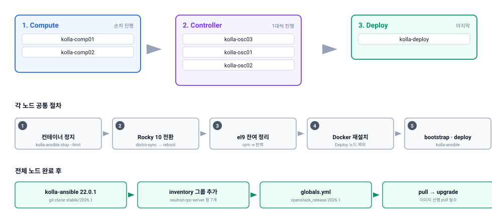

kolla-ansible 기반 OpenStack을 **Epoxy(2025.1) → Gazpacho(2026.1)** 로 올리면서, OS도 **Rocky Linux 9.7 → 10.2** 로 함께 전환하는 절차입니다.

같은 작업을 앞두고 계신 분이 그대로 따라갈 수 있도록, 환경 정보부터 명령어와 확인 방법까지 순서대로 정리했습니다. 국내 자료가 거의 없는 조합이라 참고가 되길 바랍니다.

## 0. 이 문서를 읽기 전에

| 항목 | 내용 |
|---|---|
| 대상 | kolla-ansible로 구축한 OpenStack Epoxy 운영자 |
| 전제 | Neutron은 OVN, 컨테이너 런타임은 Docker |
| 방식 | 롤링 업그레이드 + OS in-place 전환(`dnf distro-sync`) |
| 다운타임 | 노드 단위 순차 정지이므로 전체 중단은 없으나, 컨트롤러 작업 중 API 응답 지연 발생 |
| 되돌리기 | OS in-place 전환은 롤백이 사실상 불가. **스냅샷 또는 백업 필수** |

### 왜 두 가지를 함께 하는가

Gazpacho는 SLURP 릴리스입니다. 직전 SLURP인 Epoxy에서 **중간의 Flamingo(2025.2)를 건너뛰고 바로** 올라갈 수 있습니다.

OS를 함께 올리는 것은 선택이 아니라 필수에 가깝습니다.

| 이유 | 내용 |
|---|---|
| 컨테이너 이미지 | Gazpacho 이미지 태그가 `2026.1-rocky-10` |
| Python 요구사항 | kolla-ansible 2026.1은 **Python 3.11 이상** 필요, Rocky 9 기본은 3.9 |
| 배포 도구 | kolla-ansible 2026.1은 **PyPI 미제공**, git clone 필요 |

## 1. 대상 환경

### 1.1 노드 구성

컨트롤러 3대, 컴퓨트 2대, 배포 노드 1대 구성입니다.

| 구분 | 호스트명 | 관리 IP | 역할 | OS Before | OS After |
|---|---|---|---|---|---|
| Deploy | kolla-deploy | 10.10.11.178 | kolla-ansible 실행 | Rocky 9.7 | Rocky 10.2 |
| Controller | kolla-osc01 | 10.10.11.179 | control, network | Rocky 9.7 | Rocky 10.2 |
| Controller | kolla-osc02 | 10.10.11.180 | control, network | Rocky 9.7 | Rocky 10.2 |
| Controller | kolla-osc03 | 10.10.11.181 | control, network | Rocky 9.7 | Rocky 10.2 |
| Compute | kolla-comp01 | 10.10.11.182 | compute | Rocky 9.7 | Rocky 10.2 |
| Compute | kolla-comp02 | 10.10.11.183 | compute | Rocky 9.7 | Rocky 10.2 |

> 관리 IP는 테스트베드 기준 예시입니다. 실제 환경의 값으로 바꿔서 사용하세요. 이하 명령어에 등장하는 인벤토리 경로(`/root/multinode`)와 venv 경로(`/opt/kolla-venv`)도 마찬가지입니다.

### 1.2 버전 정보

| 항목 | Before | After |
|---|---|---|
| OpenStack | Epoxy (2025.1) | Gazpacho (2026.1) |
| kolla-ansible | 18.8.0 (PyPI) | 22.0.1 (git `stable/2026.1`) |
| OS | Rocky Linux 9.7 | Rocky Linux 10.2 |
| Python (Deploy) | 3.9 | 3.12 |
| Neutron Plugin | OVN | OVN |
| 컨테이너 이미지 태그 | `2025.1-rocky-9` | `2026.1-rocky-10` |

### 1.3 전체 순서

**컴퓨트 → 컨트롤러 → 배포 노드** 순으로 진행합니다.

[](upgrade-order.svg "클릭하면 원본 크기로 열립니다")

배포 노드를 마지막에 두는 이유는 배포 노드가 살아 있어야 다른 노드에 명령을 내릴 수 있기 때문입니다. 컴퓨트를 먼저 하는 것은 장애 시 영향 범위가 가장 작아서입니다.

## 2. 사전 준비

### 2.1 DB 백업 (필수)

배포 노드에서 실행합니다.

```bash
source /opt/kolla-venv/bin/activate
kolla-ansible mariadb_backup -i /root/multinode
```

### 2.2 현재 상태 기록

문제 발생 시 비교 기준이 됩니다. 배포 노드에서 실행합니다.

```bash
source /etc/kolla/admin-openrc.sh
openstack endpoint list        > /root/pre-upgrade-endpoint.txt
openstack compute service list > /root/pre-upgrade-compute.txt
openstack network agent list   > /root/pre-upgrade-agent.txt
openstack volume service list  > /root/pre-upgrade-volume.txt
openstack server list --all-projects > /root/pre-upgrade-vm.txt
```

### 2.3 Galera 클러스터 확인

컨트롤러 노드에서 실행합니다.

```bash
docker exec -it mariadb mysql -u root -p<DB_PASSWORD>
```

```sql
SHOW STATUS LIKE 'wsrep_cluster_size';        -- 3 이어야 함
SHOW STATUS LIKE 'wsrep_local_state_comment'; -- Synced 이어야 함
```

**두 값이 정상이 아니면 진행하지 마세요.** 업그레이드 중 DB가 깨지면 복구가 어렵습니다.

### 2.4 체크리스트

| 확인 | 상태 |
|---|---|
| MariaDB 백업 완료 | ☐ |
| 현재 서비스 목록 기록 | ☐ |
| Galera `wsrep_cluster_size=3`, `Synced` | ☐ |
| 각 노드 콘솔(IPMI 등) 접근 가능 | ☐ |
| Rocky 10 저장소 접근 가능 (폐쇄망이면 미러 준비) | ☐ |
| 작업 시간 확보 (노드당 OS 전환 30분 내외) | ☐ |

## 3. OS 업그레이드 공통 절차

**모든 노드에서 동일하게 반복**하는 절차입니다. 4~6장에서 이 절차를 "3장 수행"으로 참조합니다.

실행 위치는 **업그레이드 대상 노드 자신**입니다.

### Step 1. Rocky 10 릴리스 패키지 교체 및 distro-sync

```bash
cd /tmp

REPO_URL="https://dl.rockylinux.org/pub/rocky/10/BaseOS/x86_64/os/Packages/r/"

rpm -Uvh --nodeps \
  ${REPO_URL}rocky-gpg-keys-10.2-1.1.el10.noarch.rpm \
  ${REPO_URL}rocky-release-10.2-1.1.el10.noarch.rpm \
  ${REPO_URL}rocky-repos-10.2-1.1.el10.noarch.rpm

# .rpmnew 로 생성된 신규 repo 설정을 실제 설정으로 교체
for f in /etc/yum.repos.d/*.repo.rpmnew; do
    [ -f "$f" ] || continue
    base="${f%.rpmnew}"
    [ -f "$base" ] && mv "$base" "${base}.rpmold"
    mv "$f" "$base"
done

dnf -y --disablerepo="*" \
    --enablerepo=baseos --enablerepo=appstream --enablerepo=extras \
    --releasever=10.2 --allowerasing --skip-broken \
    --setopt=deltarpm=false distro-sync

reboot
```

`.rpmnew` 교체 루프를 생략하면 릴리스 패키지를 바꿔도 기존 repo 설정이 남아 **여전히 el9 저장소를 바라봅니다.** 반드시 포함하세요.

### Step 2. el9 잔여 패키지 정리 (재부팅 후)

`distro-sync` 한 번으로 모든 패키지가 넘어가지 않습니다. 의존성 때문에 남은 el9 패키지를 반복적으로 제거합니다.

```bash
export LANG=en_US.UTF-8
dnf clean all

typeset -i n_retry
while true; do
    let n_retry++
    failed=$(rpm -e $(rpm -qa | grep '.el9\.') 2>&1 | grep 'is needed by' | awk '{print $1}' | head -n1)
    [ -z "$failed" ] && break
    pkg=$(rpm -qf $failed --queryformat "%{NAME}")
    dnf -y update $pkg || rpm -e --nodeps $(rpm -qf $failed)
done

dnf -y update && rpm --rebuilddb
```

확인:

```bash
rpm -qa | grep '.el9\.' | wc -l   # 0 이어야 함
```

### Step 3. Docker 재설치

**배포 노드는 제외**하고, 컨테이너가 뜨는 모든 노드에서 실행합니다. OS 전환 과정에서 docker-ce가 깨집니다.

```bash
dnf -y remove docker-ce
dnf -y config-manager --add-repo https://download.docker.com/linux/rhel/docker-ce.repo
dnf -y install docker-ce docker-ce-cli containerd.io docker-buildx-plugin docker-compose-plugin
systemctl enable --now docker
docker ps
```

### Step 4. OS 전환 확인

```bash
cat /etc/os-release | grep -E "^VERSION="
```

```
VERSION="10.2 (Red Quartz)"
```

## 4. 컴퓨트 노드 업그레이드

대상: `kolla-comp01` → `kolla-comp02` (한 대씩)

### 4.1 컨테이너 정지

**배포 노드에서** 실행합니다.

```bash
source /opt/kolla-venv/bin/activate
kolla-ansible stop -i /root/multinode --limit kolla-comp01 --yes-i-really-really-mean-it
```

### 4.2 OS 업그레이드

**대상 노드에서** 3장(Step 1 → 재부팅 → Step 2 → Step 3) 수행.

### 4.3 재배포

**배포 노드에서** 실행합니다.

```bash
kolla-ansible bootstrap-servers -i /root/multinode --limit kolla-comp01
kolla-ansible deploy -i /root/multinode --limit kolla-comp01
```

### 4.4 확인

```bash
source /etc/kolla/admin-openrc.sh
openstack compute service list --host kolla-comp01
```

State가 `up` 인지 확인한 뒤 `kolla-comp02`로 넘어갑니다.

## 5. 컨트롤러 노드 업그레이드

대상: `kolla-osc03` → `kolla-osc01` → `kolla-osc02` (한 대씩)

컨트롤러는 Galera 클러스터가 걸려 있어 **반드시 한 대씩** 진행합니다.

### 5.1 작업 전 Galera 확인

```bash
docker exec -it mariadb mysql -u root -p<DB_PASSWORD> \
  -e "SHOW STATUS LIKE 'wsrep_cluster_size'; SHOW STATUS LIKE 'wsrep_local_state_comment';"
```

`3` / `Synced` 를 확인한 뒤 진행합니다.

### 5.2 컨테이너 정지

**배포 노드에서** 실행합니다.

```bash
kolla-ansible stop -i /root/multinode --limit kolla-osc03 --yes-i-really-really-mean-it
```

### 5.3 OS 업그레이드

**대상 노드에서** 3장 수행.

### 5.4 재배포

**배포 노드에서** 실행합니다. 여기가 이 절차에서 가장 실수하기 쉬운 지점입니다.

```bash
kolla-ansible bootstrap-servers -i /root/multinode --limit kolla-osc03

# deploy 는 --limit 없이 전체 대상으로 실행
kolla-ansible deploy -i /root/multinode
```

`deploy`에 `--limit`을 붙이면 **Keystone Fernet key bootstrap에서 실패**합니다. 컴퓨트 때와 달리 컨트롤러는 `--limit` 없이 전체로 돌려야 합니다.

MariaDB가 올라오지 않으면 복구를 먼저 실행합니다.

```bash
kolla-ansible mariadb_recovery -i /root/multinode
```

### 5.5 확인

```bash
docker exec -it mariadb mysql -u root -p<DB_PASSWORD> \
  -e "SHOW STATUS LIKE 'wsrep_cluster_size';"
```

`3`으로 회복된 것을 확인한 뒤 다음 컨트롤러로 넘어갑니다.

## 6. 배포 노드 업그레이드 및 kolla-ansible 2026.1 설치

### 6.1 OS 업그레이드

3장의 Step 1 → 재부팅 → Step 2 수행. **Docker 재설치(Step 3)는 불필요**합니다.

### 6.2 Python 3.12 설치

```bash
dnf -y install python3.12 python3.12-devel git
```

### 6.3 kolla-ansible 2026.1 설치

**kolla-ansible 2026.1은 PyPI에 없습니다.** git에서 직접 받아야 합니다.

```bash
# 기존 venv 제거 후 Python 3.12로 재생성
rm -rf /opt/kolla-venv
python3.12 -m venv /opt/kolla-venv
source /opt/kolla-venv/bin/activate
pip install --upgrade pip

cd /opt
git clone -b stable/2026.1 https://opendev.org/openstack/kolla-ansible.git
pip install -e /opt/kolla-ansible

pip install ansible-core
kolla-ansible install-deps
```

확인:

```bash
kolla-ansible --version   # 22.x.x
ansible --version         # core 2.x
python --version          # 3.12.x
```

## 7. 설정 변경

### 7.1 inventory 신규 그룹 추가

Gazpacho에서 서비스가 세분화되며 신규 그룹이 생겼습니다. **추가하지 않으면 `upgrade` 실행 중 `groups['...']` 오류로 중단됩니다.**

```bash
cat >> /root/multinode << 'EOF'

[neutron-rpc-server:children]
network

[neutron-periodic-worker:children]
network

[neutron-ovn-maintenance-worker:children]
network

[neutron-ovn-vpn-agent:children]
network

[nova-metadata:children]
compute

[ovn-sb-db-relay:children]
network

[kolla_toolbox:children]
control
network
compute
storage
monitoring
EOF
```

### 7.2 globals.yml 수정

```bash
vi /etc/kolla/globals.yml
```

| 항목 | Before | After | 비고 |
|---|---|---|---|
| `openstack_release` | `"2025.1"` | `"2026.1"` | 필수 |
| `neutron_external_interface` | 미설정 | `"bond2"` | 미설정 시 undefined 오류. 환경의 외부 인터페이스명으로 지정 |

## 8. 업그레이드 실행

### 8.1 이미지 Pull (선행 필수)

**배포 노드에서** 실행합니다.

```bash
source /opt/kolla-venv/bin/activate
kolla-ansible pull -i /root/multinode
```

이 단계를 건너뛰고 `upgrade`를 실행하면 `check_image()` NoneType 오류가 발생합니다.

### 8.2 kolla_toolbox 수동 갱신

구버전 toolbox가 남아 있으면 `ansible-runner not found` 오류가 납니다.

**컨테이너가 뜨는 모든 노드에서** 실행합니다.

```bash
docker pull quay.io/openstack.kolla/kolla-toolbox:2026.1-rocky-10
docker rm -f kolla_toolbox
```

**배포 노드에서** 재생성합니다.

```bash
kolla-ansible deploy -i /root/multinode --tags common
```

### 8.3 upgrade 실행

```bash
kolla-ansible upgrade -i /root/multinode
```

## 9. 발생 가능한 오류

| 오류 | 원인 | 조치 |
|---|---|---|
| `check_image()` NoneType error | 2026.1 이미지 미pull | 8.1의 `kolla-ansible pull` 선행 |
| `groups['neutron-rpc-server']` 없음 | inventory 그룹 누락 | 7.1 그룹 추가 |
| `groups['nova-metadata']` 없음 | inventory 그룹 누락 | 7.1 그룹 추가 |
| `groups['ovn-sb-db-relay']` 없음 | inventory 그룹 누락 | 7.1 그룹 추가 |
| `ansible-runner not found` | kolla_toolbox 구버전 | 8.2 수동 갱신 |
| `neutron_external_interface` undefined | 변수 미정의 | 7.2에서 추가 |
| MariaDB cluster stopped | Galera 중단 | `kolla-ansible mariadb_recovery` 후 재시도 |
| Keystone Fernet bootstrap 오류 | `deploy`에 `--limit` 사용 | `--limit` 없이 전체 실행 |
| `rpm -qa \| grep el9` 잔여 다수 | Step 2 미수행 또는 중단 | Step 2 재실행 |

inventory 그룹 오류는 **한 번에 모두 나오지 않고 하나씩 순차로 발생**합니다. 7.1의 그룹을 한꺼번에 추가해두면 반복 중단을 피할 수 있습니다.

## 10. 완료 확인

### 10.1 컨테이너 이미지 태그

```bash
docker ps --format "table {{.Names}}\t{{.Image}}" | grep 2026
```

모든 컨테이너가 `2026.1-rocky-10` 태그여야 합니다.

### 10.2 OpenStack 서비스

```bash
source /etc/kolla/admin-openrc.sh
openstack endpoint list
openstack compute service list
openstack network agent list
openstack volume service list
```

2.2에서 저장한 파일과 비교해 누락된 서비스가 없는지 확인합니다.

```bash
diff /root/pre-upgrade-compute.txt <(openstack compute service list)
```

### 10.3 최종 체크리스트

| 확인 항목 | 확인 방법 | 결과 |
|---|---|---|
| 모든 노드 Rocky 10.2 | `cat /etc/os-release` | ☐ |
| el9 잔여 패키지 없음 | `rpm -qa \| grep '.el9\.'` | ☐ |
| kolla-ansible 22.x | `kolla-ansible --version` | ☐ |
| 컨테이너 `2026.1-rocky-10` | `docker ps \| grep 2026` | ☐ |
| Galera 클러스터 정상 | `SHOW STATUS LIKE 'wsrep_cluster_size'` | ☐ |
| Keystone endpoint 정상 | `openstack endpoint list` | ☐ |
| Nova compute 서비스 정상 | `openstack compute service list` | ☐ |
| Neutron agent 정상 | `openstack network agent list` | ☐ |
| Cinder 서비스 정상 | `openstack volume service list` | ☐ |
| 기존 VM 정상 동작 | `openstack server list --all-projects` | ☐ |
| Horizon 접속 정상 | 브라우저 확인 | ☐ |

## 11. 정리

| 항목 | 내용 |
|---|---|
| 방식 | 롤링 업그레이드 + OS in-place 전환 |
| 순서 | 컴퓨트 → 컨트롤러 → 배포 노드 |
| 건너뛴 릴리스 | 2025.2 Flamingo (SLURP 릴리스 특성) |
| 주의 지점 | PyPI 미제공 / inventory 신규 그룹 / kolla_toolbox 수동 갱신 / 컨트롤러 `deploy`에 `--limit` 금지 |

작업량으로 보면 **OpenStack 업그레이드 자체보다 OS 전환과 도구 체인 준비가 더 큽니다.** kolla-ansible 설치 방식 변경, Python 최소 버전 상승, inventory 구조 변경은 모두 `upgrade` 명령을 실행하기 전에 끝내야 하는 일입니다.

SLURP로 릴리스 하나를 건너뛰는 것은 분명한 이득이지만, 건너뛴 만큼 **두 릴리스치의 변경사항이 한꺼번에 적용된다**는 점은 감안해야 합니다. 작업 전 Flamingo와 Gazpacho 릴리스 노트를 모두 확인하는 편이 결국 빠릅니다.

---

**참고**

- [kolla-ansible 2026.1 문서](https://docs.openstack.org/kolla-ansible/2026.1/)
- [kolla-ansible 운영 가이드](https://docs.openstack.org/kolla-ansible/2026.1/user/operating-kolla.html)
- [Rocky Linux 10 마이그레이션 문서](https://docs.openstack.org/kolla-ansible/2025.1/user/rocky-linux-10.html)
