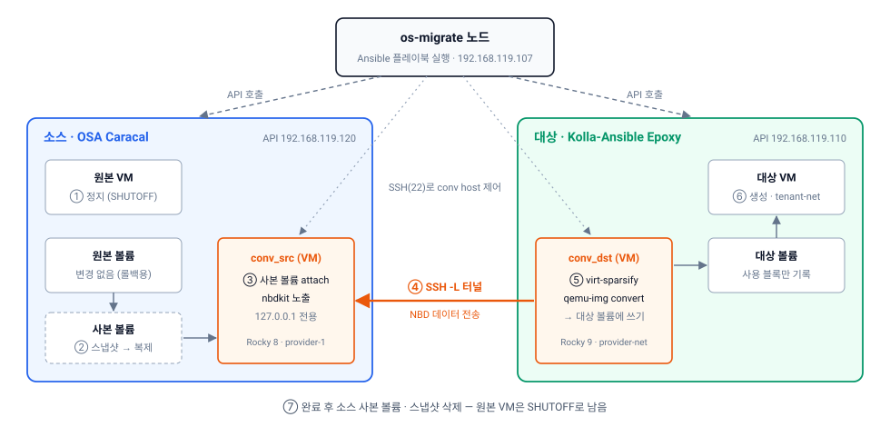

운영 중인 OpenStack을 다른 배포 도구나 새 버전의 클러스터로 옮겨야 할 때가 있습니다. 클러스터를 업그레이드하는 대신 **새 클러스터를 옆에 세우고 VM을 하나씩 옮기는 방식**입니다.

이 글은 [os-migrate](https://os-migrate.github.io/os-migrate/)로 **OpenStack-Ansible(OSA) Caracal의 VM을 Kolla-Ansible Epoxy 클러스터로 이관**한 시험 절차입니다. 실제로 성공한 명령만 순서대로 담았고, 중간에 막힌 지점과 해결 방법도 함께 적었습니다.

> 시험 환경은 사내 KVM 호스트 위에 VM으로 구성한 OpenStack 클러스터 두 개입니다. 이관 대상은 cirros VM 3대입니다.

## 0. 이 문서를 읽기 전에

| 항목 | 내용 |
|---|---|
| 대상 | 클러스터 간 VM 이관을 처음 해보는 OpenStack 운영자 |
| 소스 | OpenStack-Ansible **Caracal (2024.1)**, Ubuntu 22.04 |
| 대상 | Kolla-Ansible **Epoxy (2025.1)**, Rocky Linux 9.6 |
| 이관 대상 | 볼륨 부팅 VM 3대 (1GB · 1GB · 3GB) |
| 다운타임 | **있음.** 원본 VM을 정지한 시점부터 대상 VM이 켜질 때까지 (VM당 3~4.5분 실측) |
| 되돌리기 | 원본 볼륨은 건드리지 않으므로 **원본 VM을 다시 켜면 됩니다** |
| 소요 시간 | 준비 약 30분 + 이관 약 13분 (VM 3대, 순차 처리) |

### 함께 보면 좋은 글

- [os-migrate와 cinder-backup(NFS) 비교](/blog/os-migrate-vs-cinder-backup/): 볼륨 백업으로 옮기는 다른 방법과 선택 기준

## 1. os-migrate는 어떻게 VM을 옮기는가

명령을 치기 전에 구조부터 이해하면 막혔을 때 원인을 찾기 쉽습니다.



| 구성 요소 | 역할 |
|---|---|
| **os-migrate 노드** | Ansible 플레이북을 실행하는 작업 서버. 양쪽 클러스터의 **API**와 conversion host의 **SSH(22)**에 접근할 수 있어야 함 |
| **conversion host (conv host)** | os-migrate가 소스와 대상에 **각각 새로 만드는 VM**. 디스크를 넘겨주고 받는 역할 |
| conv_src | 원본 볼륨의 사본을 붙여서 NBD로 내보냄 |
| conv_dst | conv_src와 SSH 터널을 맺고 데이터를 받아 대상 볼륨에 씀 |

conv host가 물리 서버가 아니라 VM인 이유는 단순합니다. **Nova는 볼륨을 인스턴스에만 붙일 수 있기 때문**입니다.

**VM 한 대가 옮겨지는 순서**

| 순서 | 동작 | 위치 |
|---|---|---|
| 1 | 원본 VM 정지 | 소스 |
| 2 | 루트 볼륨 스냅샷 → 스냅샷으로 **사본 볼륨** 생성 (원본은 그대로 둠) | 소스 |
| 3 | 사본 볼륨을 conv_src에 붙이고 NBD로 노출 (127.0.0.1에만) | conv_src |
| 4 | conv_dst가 SSH `-L` 터널로 접속 | conv_dst → conv_src |
| 5 | 대상 볼륨 생성 → `virt-sparsify`로 빈 블록 정리 → `qemu-img convert`로 쓰기 | conv_dst |
| 6 | 대상 VM 생성 | 대상 |
| 7 | 소스 사본 볼륨 · 스냅샷 삭제 | 소스 |

- **실제 사용 중인 블록만 전송**합니다. sparsify에 실패하면 디스크 전체를 raw로 복사합니다.
- os-migrate 노드는 **옮길 원본 VM과 통신할 필요가 없습니다.** conv host와만 통신하면 됩니다.
- 원본 VM이 **SHUTOFF 상태여야** 이관됩니다. 그래서 무중단 이관이 아닙니다.

## 2. 시험 환경

| 구분 | 소스 | 대상 | os-migrate 노드 |
|---|---|---|---|
| 배포 도구 · 버전 | OSA Caracal (2024.1) | Kolla-Ansible Epoxy (2025.1) | — |
| 컨트롤러 | cara-tb-osc01 (192.168.119.120) | osi-tb-osc03 (192.168.119.110) | 192.168.119.107 |
| OS | Ubuntu 22.04 | Rocky Linux 9.6 | Rocky Linux 10.2 (4 vCPU / 7.5GB) |
| API 접근 | public 192.168.119.120 | public 192.168.119.110 | internal(10.10.11.x)은 접근 불가 → **public endpoint 사용** |
| VM 네트워크 | provider-1 (192.168.119.0/24) | tenant-net (geneve, 50.50.50.0/24) | — |

**이관 대상 VM**

| VM | 컴퓨트 | IP | 부팅 볼륨 |
|---|---|---|---|
| cirros-1 | cara-tb-comp01 | 192.168.119.63 | 1GB |
| cirros-2 | cara-tb-comp02 | 192.168.119.62 | 1GB |
| cirros-3 | cara-tb-comp03 | 192.168.119.64 | 3GB |

## 3. os-migrate 노드 설치

### 3-1. 시스템 패키지

```bash
dnf -y install python3-pip python3-devel git gcc libffi-devel openssl-devel jq rsync tar vim-enhanced make
dnf -y install epel-release
dnf -y install sshpass openssh-clients python3-dnf rhel-system-roles git-core
```

- `rhel-system-roles` RPM이 `redhat.rhel_system_roles` 컬렉션을 제공합니다. conversion host를 구성할 때 이 컬렉션을 씁니다.

### 3-2. Python 가상환경

```bash
python3 -m venv /opt/os-migrate-venv
source /opt/os-migrate-venv/bin/activate
pip install -U pip setuptools wheel
pip install ansible-core openstacksdk python-openstackclient passlib PyYAML jmespath
```

| 패키지 | 시험 버전 |
|---|---|
| ansible-core | 2.21.5 |
| openstacksdk | 4.20.0 |
| python-openstackclient | 10.3.0 |
| jmespath | 1.1.0 |

`jmespath`는 os-migrate 의존성 목록에 없지만, 플레이북이 쓰는 `json_query` 필터에 필요합니다.

### 3-3. os-migrate 컬렉션 — 소스에서 패치해서 빌드

이 단계가 가장 중요합니다. `ansible-galaxy collection install os_migrate.os_migrate`로 받은 **1.0.5 배포본으로는 이번 환경에서 동작하지 않았습니다.**

| 겪은 문제 | 오류 메시지 | 해결 |
|---|---|---|
| 모듈이 없음 | `couldn't resolve module/action 'os_migrate.os_migrate.compute_flavor_info'` | 소스 1.0.5에 openstack.cloud 2.5.0 모듈 28개를 복사해 다시 빌드 |
| 최신 openstacksdk와 버전 확인 방식이 맞지 않음 | `module 'openstack' has no attribute 'version'` | upstream main 커밋 `42cf68e`와 같은 방식으로 수정 |
| openstack.cloud 2.5.0에도 같은 문제 | `Module failed: module 'openstack' has no attribute 'version'` | 같은 방식으로 수정 |
| 필터가 없음 | `No filter named 'json_query'` | `community.general` 컬렉션 설치 |

> 이 문제들이 os-migrate 자체의 결함인지, 이번 버전 조합(ansible-core 2.21, openstacksdk 4.20)에서만 생기는 것인지는 확인하지 못했습니다. 다른 버전 조합이라면 결과가 다를 수 있습니다.

아래 명령을 순서대로 실행합니다.

```bash
source /opt/os-migrate-venv/bin/activate
mkdir -p /tmp/osm && cd /tmp/osm

# (1) 소스 받기: os-migrate 1.0.5, openstack.cloud 2.5.0
git clone -q https://github.com/os-migrate/os-migrate.git src
git -C src -c advice.detachedHead=false checkout -q 1.0.5
git -c advice.detachedHead=false clone -q --depth 1 -b 2.5.0 \
    https://github.com/openstack/ansible-collections-openstack.git osc

# (2) openstack.cloud 모듈 28개 + module_utils 2개를 os-migrate에 복사
cd /tmp/osm/src
MODS="auth compute_flavor compute_flavor_info floating_ip identity_domain identity_role identity_user \
identity_user_info image image_info keypair network networks_info port project project_info role_assignment \
router security_group security_group_rule server server_action server_info server_volume subnet subnets_info \
volume volume_info"
for m in $MODS; do cp /tmp/osm/osc/plugins/modules/$m.py plugins/modules/; done
for u in openstack ironic; do cp /tmp/osm/osc/plugins/module_utils/$u.py plugins/module_utils/; done

# (3) openstacksdk 버전 확인 방식 수정 (prelude)
F=roles/prelude_common/tasks/main.yml
sed -i 's|python3 -c "import openstack; print(openstack.version.__version__)"|python3 -c "import importlib.metadata; print(importlib.metadata.version('"'"'openstacksdk'"'"'))"|' $F
grep -n importlib $F                                   # 1줄이 나와야 함

# (4) module_utils 수정 (os-migrate 사본)
f=plugins/module_utils/openstack.py
cp -n $f $f.orig
sed -i "s/sdk\.version\.__version__/importlib.import_module('openstack.version').__version__/" $f
grep -c "import_module('openstack.version')" $f        # 2가 나와야 함

# (5) 빌드와 설치
ansible-galaxy collection build --force --output-path /tmp/osm/build .
ansible-galaxy collection install --force /tmp/osm/build/os_migrate-os_migrate-1.0.5.tar.gz

# (6) openstack.cloud 2.5.0 설치 후 같은 수정 (복사한 모듈이 이쪽을 import함)
ansible-galaxy collection install 'openstack.cloud:==2.5.0'
OC=~/.ansible/collections/ansible_collections/openstack/cloud/plugins/module_utils/openstack.py
cp -n $OC $OC.orig
sed -i "s/sdk\.version\.__version__/importlib.import_module('openstack.version').__version__/" $OC
grep -c "import_module('openstack.version')" $OC       # 2

# (7) json_query 필터
ansible-galaxy collection install community.general
```

**확인**

```bash
ansible-galaxy collection list | grep -E 'os_migrate|openstack.cloud|community.general|rhel_system_roles'
ls ~/.ansible/collections/ansible_collections/os_migrate/os_migrate/plugins/modules/server_info.py
```

| 컬렉션 | 버전 |
|---|---|
| os_migrate.os_migrate | 1.0.5 (패치 빌드본) |
| openstack.cloud | 2.5.0 (패치) |
| community.general | 13.x |
| redhat.rhel_system_roles | 1.120.x |

### 3-4. 작업 디렉터리와 인증서

```bash
mkdir -p /root/os-migrate/{certs,data/admin,logs,build}
cd /root/os-migrate
```

- `data/admin`은 **반드시 미리 만들어야 합니다.** os-migrate가 자동으로 만들지 않아 `Destination directory ... does not exist`로 실패합니다.
- 양쪽 API가 HTTPS라면 CA 인증서를 `certs/`에 넣습니다.

```bash
# certs/osa-cert.crt  : 소스 CA 번들
# certs/kolla-root.crt: 대상 CA (xxxCA)
curl --cacert certs/osa-cert.crt   https://192.168.119.120:5000/v3   # 둘 다 HTTP 200이면 정상
curl --cacert certs/kolla-root.crt https://192.168.119.110:5000/v3
```

**localhost_inventory.yml**

```yaml
migrator:
  hosts:
    localhost:
      ansible_connection: local
      ansible_python_interpreter: /opt/os-migrate-venv/bin/python
```

**run.sh** — 플레이북을 실행하고 로그와 결과(rc, 소요 시간)를 남기는 도우미입니다.

```bash
#!/bin/bash
# 사용: ./run.sh <playbook-name>  -> logs/<name>.log, logs/<name>.done
export TERM=dumb ANSIBLE_NOCOLOR=1; source /opt/os-migrate-venv/bin/activate; cd /root/os-migrate
P=~/.ansible/collections/ansible_collections/os_migrate/os_migrate/playbooks
rm -f logs/$1.done; S=$(date +%s)
ansible-playbook -v -i localhost_inventory.yml -e @os-migrate-vars.yml $P/$1.yml > logs/$1.log 2>&1
echo "rc=$? start=$(date -d @$S +%T) elapsed=$(( $(date +%s)-S ))s" > logs/$1.done
```

```bash
chmod +x run.sh
```

### 3-5. 변수 파일 os-migrate-vars.yml

os-migrate가 제공하는 파일이 아니라 **직접 작성하는 파일**입니다. 비밀번호가 들어가므로 `chmod 600`으로 둡니다.

```yaml
### 소스: OSA Caracal
os_migrate_src_auth:
  auth_url: https://192.168.119.120:5000/v3
  username: admin
  password: <SRC_ADMIN_PW>
  project_name: admin
  project_domain_name: Default
  user_domain_name: Default
os_migrate_src_region_name: RegionOne
os_migrate_src_validate_certs: true
os_migrate_src_ca_cert: /root/os-migrate/certs/osa-cert.crt

### 대상: Kolla-Ansible Epoxy
os_migrate_dst_auth:
  auth_url: https://192.168.119.110:5000/v3
  username: admin
  password: <DST_ADMIN_PW>
  project_name: admin
  project_domain_name: Default
  user_domain_name: Default
os_migrate_dst_region_name: RegionOne
os_migrate_dst_validate_certs: true
os_migrate_dst_ca_cert: /root/os-migrate/certs/kolla-root.crt

### export 데이터 디렉터리 (미리 mkdir)
os_migrate_data_dir: /root/os-migrate/data/admin

### Conversion host: provider 네트워크에 직접 연결 (라우터 · FIP 사용 안 함)
os_migrate_conversion_flavor_name: osm-conv
os_migrate_src_conversion_flavor_name: osm-conv
os_migrate_dst_conversion_flavor_name: osm-conv
os_migrate_conversion_host_ssh_user: rocky
os_migrate_src_conversion_image_name: rocky-8      # 소스 nova cpu_mode 설정상 Rocky 8 사용
os_migrate_dst_conversion_image_name: rocky-9-8
os_migrate_src_conversion_manage_network: false
os_migrate_dst_conversion_manage_network: false
os_migrate_src_conversion_manage_fip: false
os_migrate_dst_conversion_manage_fip: false
os_migrate_src_conversion_net_name: provider-1
os_migrate_dst_conversion_net_name: provider-net

# conv host 도구 설치: 기본 설치 role이 CentOS/RedHat만 처리해서 Rocky는 hook으로 설치
os_migrate_src_conversion_host_pre_content_hook: &convhook |
  set -e
  grep -q '^nameserver' /etc/resolv.conf || echo 'nameserver 8.8.8.8' >> /etc/resolv.conf
  dnf -y -q install nbdkit nbdkit-basic-plugins qemu-img libvirt
  dnf -y -q install guestfs-tools || dnf -y -q install libguestfs-tools-c
  systemctl enable --now libvirtd
os_migrate_dst_conversion_host_pre_content_hook: *convhook

### Workload
os_migrate_workload_stop_before_migration: true    # 원본을 자동으로 정지 (SHUTOFF여야 이관됨)
os_migrate_workloads_filter:
  - regex: '^cirros-'                              # 이관할 VM만 선택
```

**주요 설정의 의미**

| 설정 | 왜 이렇게 했나 |
|---|---|
| `manage_network: false`, `manage_fip: false` | 기본값은 conv host용 네트워크 · 라우터 · FIP를 새로 만듭니다. provider 네트워크에 바로 붙이면 **IP를 클러스터당 1개만** 쓰고, os-migrate 노드에서 바로 SSH로 접근할 수 있습니다 |
| `conversion_host_ssh_user: rocky` | Rocky cloud 이미지의 기본 사용자 (role 기본값은 `cloud-user`) |
| `pre_content_hook` | conv host에 nbdkit, qemu-img, virt-sparsify를 설치. Rocky 이미지에서는 기본 설치 role이 아무것도 설치하지 않았습니다 |
| `stop_before_migration: true` | 원본이 켜져 있으면 import가 실패합니다 |
| `workloads_filter` | conv host까지 workload로 잡히지 않게 이관 대상만 지정 |

**연결 확인**

```bash
cd /root/os-migrate && /opt/os-migrate-venv/bin/python - <<'PY'
import yaml, openstack, warnings; warnings.filterwarnings("ignore")
v = yaml.safe_load(open("os-migrate-vars.yml"))
for s in ("src", "dst"):
    c = openstack.connect(auth=v[f"os_migrate_{s}_auth"], cacert=v[f"os_migrate_{s}_ca_cert"],
                          region_name="RegionOne", interface="public")
    print(s, "servers:", [(x.name, x.status) for x in c.compute.servers()])
PY
```

양쪽 VM 목록이 나오면 준비가 끝났습니다.

## 4. 클러스터 쪽 사전 준비

### 4-1. conv host용 flavor (양쪽)

```bash
openstack flavor create --vcpus 2 --ram 4096 --disk 20 --public osm-conv
```

기존 flavor가 `disk=0`(볼륨 부팅 전용)이면 이미지로 부팅하는 conv host에 쓸 수 없어서 따로 만듭니다.

### 4-2. conv host용 이미지

| 클러스터 | 이미지 | 비고 |
|---|---|---|
| 대상 | rocky-9-8 | 기존 이미지 사용 |
| 소스 | rocky-8 | 소스 nova `cpu_mode` 설정상 Rocky 9 대신 Rocky 8 사용 |

```bash
cd /root/os-migrate/build
curl -fL -o rocky-8.qcow2 https://dl.rockylinux.org/pub/rocky/8/images/x86_64/Rocky-8-GenericCloud-Base.latest.x86_64.qcow2
openstack image create --disk-format qcow2 --container-format bare --public --file rocky-8.qcow2 rocky-8
```

### 4-3. conv host용 IP

conv host는 provider 네트워크에서 IP를 하나씩 받습니다. 남는 IP가 없으면 allocation pool을 늘립니다.

```bash
# 쓰지 않는 IP인지 먼저 확인 (응답이 없어야 함)
arping -c2 -I enp1s0 192.168.119.66

# 소스 provider-1 pool에 .66–.67 추가
openstack subnet set --allocation-pool start=192.168.119.66,end=192.168.119.67 provider-1-subnet
```

## 5. 이관 실행

```bash
cd /root/os-migrate
```

### 5-1. export

```bash
./run.sh export_flavors;   cat logs/export_flavors.done
./run.sh export_workloads; cat logs/export_workloads.done
grep -E 'name: cirros' data/admin/workloads.yml       # cirros-1/2/3이 보여야 함
```

> **네트워크 · 서브넷 · 보안그룹은 export/import하지 않았습니다.** 소스와 대상에 `provider-net`이라는 **같은 이름의 다른 네트워크**(physnet과 CIDR이 다름)가 있었기 때문입니다. 그대로 import하면 대상의 운영 네트워크를 바꾸려고 시도합니다. 대신 다음 단계에서 VM 포트를 대상의 기존 네트워크로 연결합니다.

### 5-2. 대상 네트워크로 매핑 (workloads.yml 편집)

VM 포트를 대상 `tenant-net`에 붙이고, 추적하기 쉽게 IP 끝자리를 유지합니다. (192.168.119.62 → 50.50.50.62)

```bash
cd /root/os-migrate/data/admin && cp workloads.yml workloads.yml.orig
/opt/os-migrate-venv/bin/python - <<'P'
import yaml
f = '/root/os-migrate/data/admin/workloads.yml'; d = yaml.safe_load(open(f))
d['resources'] = [r for r in d['resources'] if r['params']['name'].startswith('cirros-')]
for r in d['resources']:
    for p in r['params']['ports']:
        pp = p['params']; pp['network_ref']['name'] = 'tenant-net'
        for ip in pp['fixed_ips_refs']:
            ip['subnet_ref']['name'] = 'tenant-net'
            ip['ip_address'] = ip['ip_address'].replace('192.168.119.', '50.50.50.')
yaml.safe_dump(d, open(f, 'w'), default_flow_style=False, sort_keys=False)
for r in d['resources']:
    p = r['params']
    print(p['name'], [(x['params']['network_ref']['name'], [i['ip_address'] for i in x['params']['fixed_ips_refs']]) for x in p['ports']])
P
```

- 기대 출력: `cirros-1 [('tenant-net', ['50.50.50.63'])]`
- 대상에서 해당 IP가 비어 있는지 먼저 확인하세요.
- MAC 주소는 그대로 둡니다.

### 5-3. conversion host 배포

```bash
./run.sh deploy_conversion_hosts; cat logs/deploy_conversion_hosts.done
```

**소스 conv host가 Rocky 8이면 1차 실행은 실패합니다.** ansible-core 2.21은 Python 3.9 이상이 필요한데 Rocky 8 기본은 3.6이라서 `No python interpreters found`로 멈춥니다. 서버는 이미 만들어졌으니 Python만 넣고 다시 실행합니다.

```bash
ssh -o StrictHostKeyChecking=no -i data/admin/conversion/ssh.key rocky@192.168.119.66 \
  'grep -q "^nameserver" /etc/resolv.conf || echo "nameserver 8.8.8.8" | sudo tee -a /etc/resolv.conf;
   sudo dnf -y -q install python3.12 && python3.12 --version'

mv logs/deploy_conversion_hosts.log logs/deploy_conversion_hosts.try1.log
./run.sh deploy_conversion_hosts; cat logs/deploy_conversion_hosts.done   # rc=0 (기존 서버 · 키 재사용)
```

> Python을 미리 넣은 Rocky 8 이미지(`virt-customize -a rocky-8.qcow2 --install python3.12`)를 준비하면 한 번에 끝날 것으로 예상합니다. 이번 시험에서는 검증하지 않았습니다.

**확인**

```bash
K=data/admin/conversion/ssh.key
for h in 192.168.119.66 <conv_dst_IP>; do
  ssh -o StrictHostKeyChecking=no -i $K rocky@$h \
    'cat /etc/rocky-release; for b in nbdkit qemu-img virt-sparsify qemu-nbd; do command -v $b || echo MISSING $b; done; systemctl is-active libvirtd'
done
# conv_dst → conv_src SSH 연결
ssh -i $K rocky@<conv_dst_IP> 'ssh -o StrictHostKeyChecking=no rocky@192.168.119.66 hostname'
```

`MISSING`이 하나도 없고 마지막 명령이 conv_src의 hostname을 출력하면 정상입니다.

### 5-4. import

```bash
./run.sh import_flavors; cat logs/import_flavors.done    # 대상에 같은 flavor가 있으면 changed=0이 정상

nohup ./run.sh import_workloads >/dev/null 2>&1 &
tail -f data/admin/workload_logs/cirros-3.log           # VM별 진행 로그
cat logs/import_workloads.done                           # 끝나면 rc=0
```

- VM은 **한 대씩 순차 처리**됩니다.
- **실패해도 os-migrate가 정리합니다.** 실패한 VM의 대상 볼륨 · 포트와 소스 사본 · 스냅샷을 지우고, 원본은 SHUTOFF로 남깁니다. 원인을 해결하고 같은 명령을 다시 실행하면 됩니다.
- 이미 성공한 VM은 `already exists on destination, skipping`으로 건너뜁니다.

## 6. 검증

### 6-1. API 상태

```bash
cd /root/os-migrate && /opt/os-migrate-venv/bin/python - <<'PY'
import yaml, openstack, warnings; warnings.filterwarnings("ignore")
v = yaml.safe_load(open("os-migrate-vars.yml"))
for s in ("src", "dst"):
    c = openstack.connect(auth=v[f"os_migrate_{s}_auth"], cacert=v[f"os_migrate_{s}_ca_cert"],
                          region_name="RegionOne", interface="public")
    for x in c.compute.servers(details=True):
        if x.name.startswith("cirros"):
            print(s, x.name, x.status, x.hypervisor_hostname, [a['addr'] for n in x.addresses.values() for a in n])
PY
```

- 대상: cirros-1/2/3 모두 **ACTIVE**, 50.50.50.x
- 소스: 모두 **SHUTOFF**, 원래 볼륨이 그대로 붙어 있음

### 6-2. 게스트 접속

tenant-net은 os-migrate 노드에서 바로 닿지 않아서, 대상 컴퓨트의 OVN metadata 네임스페이스에서 확인했습니다.

```bash
# VM이 배치된 대상 컴퓨트에서
NS=$(ip netns | awk '/ovnmeta-/{print $1}' | head -1)   # tenant-net ID로 시작하는 것
for ip in 50.50.50.62 50.50.50.63 50.50.50.64; do
  ip netns exec $NS ping -c2 $ip
  ip netns exec $NS sshpass -p gocubsgo ssh -o StrictHostKeyChecking=no cirros@$ip 'hostname; df -h /'
done
```

| VM | 상태 | ping | SSH | 게스트 확인 |
|---|---|---|---|---|
| cirros-1 | ACTIVE | OK | OK | hostname=cirros-1, / 960.8M |
| cirros-2 | ACTIVE | OK | OK | hostname=cirros-2, / 960.8M |
| cirros-3 | ACTIVE | OK | OK | hostname=cirros-3, / 2.8G |

## 7. 정리

```bash
./run.sh delete_conversion_hosts; cat logs/delete_conversion_hosts.done   # 약 49초
```

| 삭제되는 것 | 남는 것 |
|---|---|
| 양쪽 conv host 서버, `os_migrate_conv` 보안그룹, keypair | flavor `osm-conv`, conv host 이미지, 늘린 IP pool, 소스 원본 VM(SHUTOFF), 대상 이관 VM |

원본 VM은 대상이 안정적으로 동작하는 것을 충분히 확인한 뒤 지우세요.

## 8. 실측 결과

| VM | 크기 | sparsify | 데이터 복사 | VM당 합계 (다운타임) |
|---|---|---|---|---|
| cirros-3 | 3GB | 94초 | 82초 | 약 4분 24초 |
| cirros-2 | 1GB | 95초 | 18초 | 약 3분 21초 |
| cirros-1 | 1GB | 78초 | 18초 | 약 3분 3초 |

| 단계 | 소요 시간 |
|---|---|
| deploy_conversion_hosts | 335초 (+ Python 설치 후 재실행) |
| import_workloads (VM 3대) | 770초 |
| delete_conversion_hosts | 49초 |

- **가장 오래 걸린 단계는 sparsify(VM당 약 90초)**입니다. 데이터 크기와 거의 관계없이 고정으로 들었는데, conv host가 중첩 가상화 위에서 libguestfs appliance를 띄우는 비용으로 보입니다.
- 데이터 복사는 1GB 18초, 3GB 82초였습니다.

## 9. 막혔을 때 찾아보기

| 증상 (오류 메시지) | 원인 | 해결 | 위치 |
|---|---|---|---|
| `couldn't resolve module/action 'os_migrate.os_migrate.compute_flavor_info'` | 설치한 컬렉션에 모듈이 없음 | 소스 빌드 + openstack.cloud 모듈 복사 | 3-3 |
| `module 'openstack' has no attribute 'version'` | openstacksdk 4.15 이상과 버전 확인 방식 불일치 | prelude · module_utils 수정 | 3-3 |
| `No filter named 'json_query'` | community.general · jmespath 없음 | 설치 | 3-2, 3-3 |
| `Destination directory ... does not exist` | data_dir 자동 생성 안 됨 | `mkdir -p` | 3-4 |
| conv host에 nbdkit · virt-sparsify 없음 (오류 없이 넘어감) | 기본 설치 role이 Rocky를 처리하지 않음 | `pre_content_hook`으로 설치 | 3-5 |
| `No python interpreters found` (conv_src) | Rocky 8 기본 Python 3.6 | python3.12 설치 후 재실행 | 5-3 |
| import 실패: 원본 VM 상태 오류 | 원본이 SHUTOFF가 아님 | `stop_before_migration: true` | 3-5 |
| `already exists on destination, skipping` | 대상에 같은 이름의 VM이 있음 | 대상 VM · 볼륨 삭제 후 재실행 | 5-4 |

## 10. 정리하며

| 장점 | 주의할 점 |
|---|---|
| VM · 포트 · flavor · 볼륨을 **한 번에** 옮김 | 원본 VM 정지가 필요해 **다운타임**이 생김 |
| 원본을 건드리지 않아 **롤백이 쉬움** | 소스와 대상 클러스터가 **동시에 떠 있어야** 함 |
| 실패하면 스스로 정리하고 재실행 가능 | 이번 환경에서는 컬렉션 **패치 빌드**가 필요했음 |
| 사용 중인 블록만 전송 | conv host가 양쪽에 필요 (IP · flavor · 이미지 준비) |

클러스터를 재설치해야 해서 소스와 대상을 동시에 띄울 수 없는 경우에는 다른 방법이 필요합니다. 그 경우는 [os-migrate와 cinder-backup(NFS) 비교](/blog/os-migrate-vs-cinder-backup/)에서 다룹니다.
