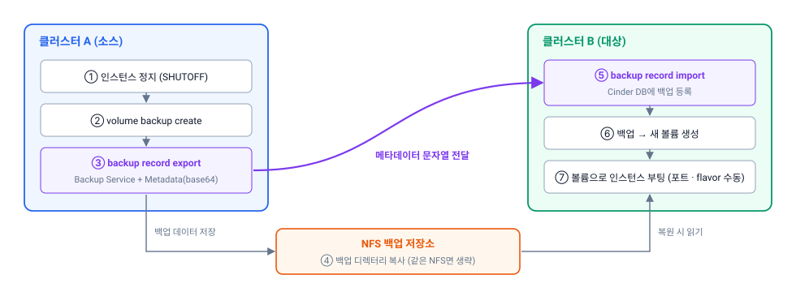

클러스터 간 VM을 옮기는 방법은 os-migrate만 있는 것이 아닙니다. **볼륨 백업을 다른 클러스터에서 복원**하는 방법도 있습니다.

이 글에서는 cinder-backup(NFS 드라이버)으로 볼륨을 옮기는 절차를 정리하고, [os-migrate 이관 시험](/blog/os-migrate-osa-to-kolla/)과 비교합니다.

> cinder-backup 시험은 운영 환경 작업을 지원하기 위해 **사내 테스트베드에서 미리 검증**한 내용입니다.

## 1. 원리



| 단계 | 하는 일 | 핵심 |
|---|---|---|
| 백업 | 클러스터 A의 cinder-backup이 볼륨을 NFS에 저장 | 데이터는 NFS에 **파일(청크)**로 남음 |
| record export | 백업 메타데이터를 문자열(base64)로 꺼냄 | 데이터가 아니라 **"어디에 무엇이 있는지" 정보** |
| 데이터 이동 | 백업 디렉터리를 클러스터 B의 backup 경로로 복사 (같은 NFS를 쓰면 생략) | |
| record import | 클러스터 B의 Cinder DB에 백업을 등록 | B에서 `backup list`에 보이게 됨 |
| 복원 | 백업 → 새 볼륨 → 그 볼륨으로 인스턴스 부팅 | 포트 · flavor 등은 **직접 다시 만듦** |

os-migrate와 달리 **볼륨 데이터만** 옮깁니다. 인스턴스, 네트워크 포트, 보안그룹은 대상에서 다시 만들어야 합니다.

## 2. 절차

### 2-1. 사전 조건

| 항목 | 내용 |
|---|---|
| 양쪽 cinder-backup | NFS 드라이버(`cinder.backup.drivers.nfs.NFSBackupDriver`) 사용 |
| 백업 저장소 | 같은 NFS를 쓰거나, A의 백업 디렉터리를 B의 backup 경로로 복사할 수 있어야 함 |
| 권한 | record export/import는 **admin** 권한 필요 |

### 2-2. 백업 전에 인스턴스 정지

**반드시 인스턴스를 정지한 뒤 백업하세요.**

시험에서 인스턴스를 켠 채로 백업하고 복원했더니, 백업 직전에 수정한 파일은 **존재하지만 내용이 비어 있었습니다.** 게스트 메모리에만 있고 디스크에 기록되지 않은 데이터는 백업에 들어가지 않습니다.

```bash
openstack server stop <SERVER>
openstack server show <SERVER> -c status        # SHUTOFF 확인
```

### 2-3. 클러스터 A — 백업 생성과 record export

```bash
# 사용 중인 볼륨이면 --force 필요 (정지 상태여도 attach되어 있으면 in-use)
openstack volume backup create --name vm1-root --force <VOLUME_ID>
openstack volume backup list                     # Status가 available이 될 때까지 대기

openstack volume backup record export <BACKUP_ID>
```

출력 예:

| Field | Value |
|---|---|
| Backup Service | `cinder.backup.drivers.nfs.NFSBackupDriver` |
| Metadata | `eyJkcml2ZXJfaW5mbyI6IHt9LCAiaWQiOi...` (긴 base64 문자열) |

두 값을 복사해 둡니다. (`cinder backup-export <BACKUP_ID>`로도 같은 값을 얻을 수 있습니다.)

### 2-4. 백업 데이터를 클러스터 B로

같은 NFS를 쓰지 않는다면, A의 backup 경로에 생긴 **최상위 디렉터리**를 B의 backup 경로로 그대로 복사합니다.

```bash
# A의 NFS 백업 경로 (예)
ls /nfs_mount/osa/cinder_backup/
53                                    # 백업 ID 앞 두 글자로 만들어진 디렉터리

# B의 cinder-backup NFS 경로로 복사 (경로 구조 유지)
rsync -a /nfs_mount/osa/cinder_backup/53 <B_BACKUP_NFS_PATH>/
```

메타데이터 안의 `container` 값(예: `53/7c/<BACKUP_ID>`)이 이 경로를 가리키므로 **디렉터리 구조를 바꾸면 안 됩니다.**

### 2-5. 클러스터 B — record import와 복원

```bash
openstack volume backup record import \
  cinder.backup.drivers.nfs.NFSBackupDriver <METADATA_BASE64>

openstack volume backup list                     # 같은 ID로 available 확인

# 백업에서 새 볼륨 생성
openstack volume create --backup <BACKUP_ID> --size <SIZE_GB> vm1-root-restored
# (또는) openstack volume backup restore <BACKUP_ID> <NEW_VOLUME_NAME>

# 볼륨으로 인스턴스 부팅 — 네트워크 · flavor · 보안그룹은 B 기준으로 지정
openstack server create --flavor <FLAVOR> --network <NET> \
  --volume vm1-root-restored vm1
```

### 2-6. 확인

| 확인 | 방법 |
|---|---|
| 부팅 | `openstack console log show vm1` |
| 데이터 | 백업 전에 만든 테스트 파일이 **내용까지** 있는지 |
| 볼륨 크기 | `openstack volume show`의 size와 게스트 `lsblk` 비교 |

## 3. 시험 결과

| 구분 | 결과 | 비고 |
|---|---|---|
| 같은 버전 (Caracal → Caracal) | ✅ 복원 · 부팅 정상 | |
| 다른 버전 (Antelope → Caracal) | ⚠️ 볼륨 생성은 되지만 **인스턴스 생성 시 attach 실패** | 볼륨 +1GB 확장 후 성공 |
| 인스턴스를 켠 채 백업 | ⚠️ 최근 수정한 파일 내용 누락 | 정지 후 백업 필요 |

### 다른 버전 간 복원에서 생긴 오류

```
Driver initialize connection failed (error: Invalid volume:
The volume virtual_size does not match the size in cinder, aborting as we suspect an exploit.)
```

| 항목 | 내용 |
|---|---|
| 우회 | 복원한 볼륨을 **+1GB 확장**한 뒤 인스턴스 생성 → 성공 |
| 실제 운영 환경 | 상용 스토리지 백엔드에서는 **크기 불일치가 발생하지 않음** |
| 추정 원인 | **Cinder NFS 드라이버의 크기 처리 문제**와 관련 있는 것으로 추정 |

> NFS 백엔드에서 볼륨 파일 크기와 Cinder DB 크기가 어긋난 것으로 보입니다. 다만 백업 포맷의 버전 차이, 메타데이터 처리 차이일 가능성도 배제하지 못했기 때문에 **원인은 확정하지 않았습니다.**

## 4. os-migrate와 비교

| 비교 항목 | os-migrate | cinder-backup (NFS) |
|---|---|---|
| **이관 단위** | VM 전체 (인스턴스 · 포트 · flavor · 볼륨, 선택적으로 네트워크 · 보안그룹 · 키페어) | **볼륨 데이터만** |
| **대상 리소스 생성** | 자동 | 수동 (포트 · flavor · 인스턴스 직접 생성) |
| **양쪽 클러스터 동시 운영** | **필요** (양쪽 API와 conv host가 동시에 살아 있어야 함) | **불필요** (백업 후 소스를 없애고 재설치해도 됨) |
| **데이터 경로** | conv host 간 SSH 터널로 직접 전송 | NFS 백업 파일 |
| **다운타임** | VM 정지 ~ 대상 부팅 (실측 VM당 3~4.5분) | VM 정지 ~ 백업 + 복원 + 수동 생성 완료 |
| **준비 부담** | 높음: 작업 노드, 컬렉션, 변수 파일, conv host용 flavor · 이미지 · IP | 낮음: 양쪽 cinder-backup과 NFS만 있으면 됨 |
| **필요 권한** | 양쪽 admin API | 양쪽 admin (record export/import) + NFS 접근 |
| **반복 · 대량 처리** | 플레이북으로 필터 · 일괄 처리 | VM마다 명령 반복 (스크립트로 보완) |
| **실패 시** | 자동 정리 후 재실행 | 백업이 남아 있어 복원만 다시 시도 |
| **원본 보존 · 롤백** | 원본 볼륨을 건드리지 않음 → 원본 VM 재시작으로 롤백 | 원본이 남아 있다면 동일. 재설치했다면 **백업이 유일한 사본** |
| **버전 차이 결과** | Caracal → Epoxy 성공 | 같은 버전은 성공, 다른 버전은 NFS에서 크기 오류 (확장으로 우회) |
| **백업 효과** | 없음 (이관만) | 이관하면서 **백업이 남음** |

## 5. 어떤 방법을 고를까

| 상황 | 추천 | 이유 |
|---|---|---|
| 새 클러스터를 **옆에 세우고** 순차 이관 | **os-migrate** | 포트 · flavor까지 자동, VM 수가 많을수록 유리 |
| 같은 하드웨어에 **재설치**해야 함 (동시 운영 불가) | **cinder-backup** | 소스가 사라져도 백업으로 복원 가능 |
| VM 몇 대, 볼륨만 옮기면 됨 | cinder-backup | 준비가 거의 필요 없음 |
| 네트워크 구성이 크게 바뀜 | 둘 다 가능 | os-migrate는 workloads.yml 매핑, cinder-backup은 어차피 수동 생성 |
| 백엔드가 NFS이고 버전 차이가 큼 | 사전 시험 필수 | 다른 버전 간 복원에서 크기 불일치 사례가 있음 |

**정리하면**

- **동시 운영이 가능하면 os-migrate**가 사람 손을 덜 탑니다. 대신 처음 준비에 시간이 듭니다.
- **동시 운영이 불가능하거나 대상 수가 적으면 cinder-backup**이 단순합니다. 대신 VM 정의를 직접 다시 만들어야 합니다.
- 어느 쪽이든 **인스턴스 정지 → 데이터 이동 → 대상 부팅 → 데이터 확인** 흐름은 같습니다. 원본은 대상 검증이 끝날 때까지 지우지 마세요.

## 관련 글

| 글 | 내용 |
|---|---|
| [os-migrate로 OpenStack 클러스터 간 VM 이관하기](/blog/os-migrate-osa-to-kolla/) | OSA Caracal → Kolla Epoxy 단계별 절차 |

**참고 문서**

- [Cinder — Export and import backup metadata](https://docs.openstack.org/cinder/latest/admin/volume-backups-export-import.html)
- [os-migrate documentation](https://os-migrate.github.io/os-migrate/)
