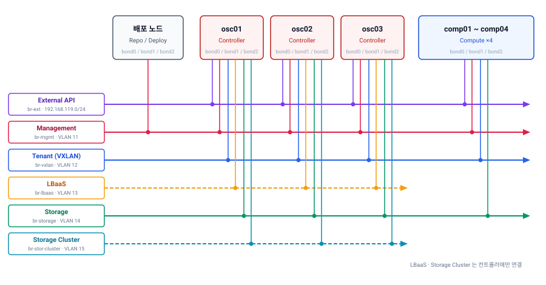
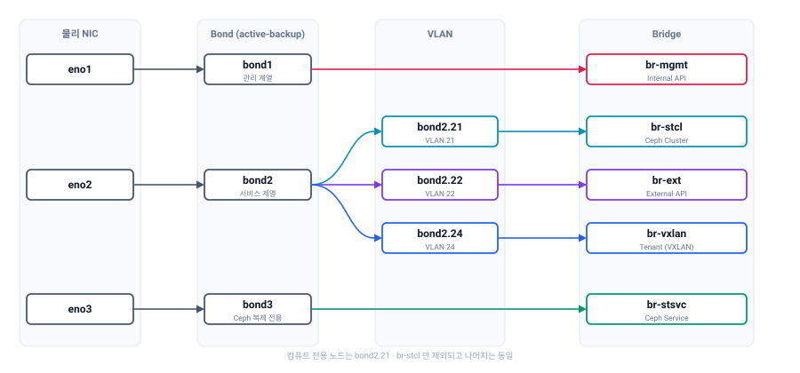
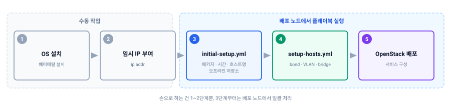

OpenStack-Ansible(OSA) 공식 가이드는 타깃 노드의 브리지 네트워크를 Ubuntu netplan으로 구성하도록 안내합니다. 저도 그동안 그렇게 해왔습니다. 노드마다 netplan YAML을 작성해 bond, VLAN, 그리고 `br-mgmt`·`br-vxlan` 같은 브리지를 잡는 방식입니다.

문제는 이 작업이 **배포 자동화의 바깥에 있다는 점**입니다. 컨트롤러 한 대에 bond 3개, VLAN 5개, 브리지 6개를 손으로 잡아야 합니다. 노드가 열 대를 넘어가면 이 작업만으로 반나절이 지나가고, 오타 하나가 배포 실패로 이어집니다. 그리고 재구축할 때마다 처음부터 반복됩니다.

## 1. 시작은 오프라인 패키지 작업이었다

Caracal 릴리스를 다루면서 `openstack_hosts` 롤에 systemd-networkd 관련 변수가 있다는 걸 알게 됐습니다. 당시엔 그냥 알아만 두고 넘어갔습니다.

다시 꺼내게 된 건 Epoxy 오프라인 패키지를 구성하면서였습니다. 폐쇄망 배포용으로 **타깃 노드에서 수행해야 할 작업을 플레이북으로 묶는 중**이었는데, 정리하다 보니 노드 준비 작업이 이런 목록이었습니다.

- 패키지 설치
- 시간 동기화(timedatectl) 설정
- 네트워크 구성 (bond / VLAN)
- 브리지 구성

앞의 셋은 이미 플레이북으로 처리하고 있었습니다. 그런데 네트워크만 netplan으로 따로 빠져 있었습니다. 여기서 `openstack_hosts`의 systemd-networkd 변수가 떠올랐습니다.

**이걸 쓰면 노드에 OS만 설치하고, `ip addr`로 배포 노드와 통신할 임시 IP 하나만 붙여두면 나머지는 전부 플레이북이 끝낼 수 있겠다** 싶었습니다. 실제로 그렇게 됐습니다.

| 단계 | 이전 | 이후 |
|---|---|---|
| OS 설치 | 수동 | 수동 |
| IP 설정 방식 | netplan으로 bond·VLAN·브리지·IP 전체 수동 구성 | `ip addr`로 임시 IP만 설정 |
| 패키지 설치 | 플레이북 | 플레이북 |
| 시간 설정 | 플레이북 | 플레이북 |
| 네트워크·브리지 | **수동 (netplan)** | **플레이북** |

수동 구간이 "OS 설치 + IP 한 줄"로 줄어듭니다.

## 2. systemd-networkd를 검토한 이유

netplan은 Ubuntu의 표준 네트워크 설정 방식이고, OSA 가이드도 이 방식을 안내합니다. 자동화가 불가능한 것도 아닙니다. Jinja2 템플릿을 만들어 뿌리면 됩니다.

그럼에도 systemd-networkd를 들여다본 이유는 이렇습니다.

| 항목 | netplan | systemd-networkd |
|---|---|---|
| 위치 | OSA 외부, 별도 롤/템플릿 필요 | `openstack_hosts` 롤에 내장 |
| 적용 방식 | netplan → renderer로 변환 | `.netdev` / `.network` 직접 생성 |
| 배포 시점 | 별도 단계 | `setup-hosts.yml` 실행 시 함께 |
| 파일 관리 | 기존 netplan 설정과 충돌 가능 | prefix로 OSA 생성분 격리 |

**Ubuntu Server에서 netplan의 기본 renderer는 systemd-networkd입니다.** netplan YAML을 쓰면 그것이 `.netdev`, `.network` 파일로 변환되어 systemd-networkd가 실제로 처리합니다. 즉 netplan은 그 위에 얹힌 변환 계층입니다.

어차피 최종적으로 systemd-networkd가 동작한다면, OSA가 이미 지원하는 경로로 직접 정의하는 편이 단계가 하나 줄어듭니다. 무엇보다 직접 만든 롤을 유지보수할 필요가 없습니다.

## 3. 변수 구조

`openstack_hosts` 롤의 기본값을 보면 이렇게 정의돼 있습니다.

```yaml
# Define extra systemd services/networks/mounts
openstack_hosts_systemd_mounts: []
# Systemd networks can be configured only on bare metal hosts
# systemd-networkd role won't run inside containers.
openstack_hosts_systemd_networkd_devices: []
openstack_hosts_systemd_networkd_networks: []
openstack_hosts_systemd_networkd_prefix: openstack-net
openstack_hosts_systemd_services: []
openstack_hosts_systemd_slice: "openstack-hosts"
```

쓰는 변수는 사실상 두 개입니다.

| 변수 | 역할 | 생성 파일 |
|---|---|---|
| `openstack_hosts_systemd_networkd_devices` | 가상 장치 정의 (bond, VLAN, bridge) | `.netdev` |
| `openstack_hosts_systemd_networkd_networks` | 장치 간 연결과 주소 할당 | `.network` |

`openstack_hosts_systemd_networkd_prefix`는 생성되는 파일명 접두어입니다. 기본값이 `openstack-net`이라 `/etc/systemd/network/` 아래에 `openstack-net-*.netdev` 형태로 떨어집니다. **기존 설정과 섞이지 않는 게 이 접두어 덕분입니다.**

주석에 적힌 대로 이 롤은 **베어메탈 호스트에서만 동작합니다.** LXC 컨테이너 안에서는 실행되지 않습니다. 노드 준비 단계 전용이라고 보면 됩니다.

## 4. 그룹별로 나눠서 정의하기

노드 역할에 따라 NIC 구성도 다르고 필요한 네트워크도 다릅니다. 그래서 `/etc/openstack_deploy/group_vars/` 아래에 그룹별 파일을 만듭니다.

```
/etc/openstack_deploy/group_vars/
├── shared-infra_hosts.yml   # 컨트롤러 그룹
└── compute_hosts.yml        # 컴퓨트 노드 그룹
```

Ansible의 group_vars 규칙을 그대로 쓰는 것이라, OSA 인벤토리에 정의된 그룹명과 파일명만 맞춰주면 됩니다.

## 5. 예시 환경

OpenStack-Ansible **Epoxy(2025.1)** 기준 테스트베드입니다. 컨트롤러 3대, 컴퓨트 4대입니다.

| 노드 | 대수 | 그룹 |
|---|---|---|
| `epo-tb-osc01` ~ `03` | 3 | `shared-infra_hosts` |
| `epo-tb-comp01` ~ `04` | 4 | `compute_hosts` |

네트워크는 여섯 개로 나눴습니다.

| 브리지 | VLAN | 용도 | 컨트롤러 | 컴퓨트 |
|---|---|---|---|---|
| `br-ext` | — (bond0 flat 직결) | External API | ✅ | ✅ |
| `br-mgmt` | 11 | 관리 · Internal API | ✅ | ✅ |
| `br-vxlan` | 12 | 테넌트 오버레이 | ✅ | ✅ |
| `br-lbaas` | 13 | LBaaS — Octavia amphora 연동 | ✅ | — |
| `br-storage` | 14 | 스토리지 서비스 | ✅ | ✅ |
| `br-stor-cluster` | 15 | 스토리지 클러스터 (복제) | ✅ | — |

**스토리지 네트워크를 둘로 나눈 이유**는 복제 트래픽이 클라이언트 I/O를 밀어내지 않게 하기 위해서입니다. 복구나 리밸런싱이 돌면 노드 간 트래픽이 순간적으로 크게 늘어나는데, 서비스 네트워크와 같은 경로를 타면 VM의 디스크 응답이 함께 느려집니다.

컴퓨트에는 `br-lbaas`와 `br-stor-cluster`가 없습니다. `br-lbaas`는 컨트롤러가 Octavia amphora와 통신하는 경로이고, 복제 트래픽은 컴퓨트를 거치지 않기 때문입니다. 다만 **VLAN 장치는 양쪽에 똑같이 선언**해뒀습니다. 나중에 필요하면 브리지만 추가하면 됩니다.

### 논리 네트워크 구성



관리 네트워크는 배포 노드가 Ansible로 붙는 경로이자 OpenStack 서비스 간 통신 경로입니다. 배포 노드는 이 망에만 물리면 됩니다.

### 물리 인터페이스 구성

논리 네트워크가 물리 NIC 위에 어떻게 쌓이는지가 실제 설정의 핵심입니다.



**NIC 세 개를 각각 bond로 묶고, 그중 `bond1`에만 VLAN을 태웁니다.** 세 bond의 역할이 명확히 갈립니다.

| bond | NIC | 역할 |
|---|---|---|
| `bond0` | enp1s0 | External API 전용. flat 구성이라 VLAN 태깅 없이 `br-ext`에 직결 |
| `bond1` | enp2s0 | 내부 서비스 네트워크. VLAN 11~15로 분리 |
| `bond2` | enp3s0 | **Provider network 용.** Neutron이 OVS 브리지로 가져감 |

**`bond2`에 Linux bridge가 없는 것은 쓰지 않아서가 아닙니다.** Provider network는 OVS 브리지를 씌워야 하므로, systemd-networkd 단계에서는 bond만 만들어두고 손대지 않습니다. 여기서 Linux bridge를 만들어버리면 OVS와 충돌합니다. 이 부분은 뒤의 10장에서 다룹니다.

컴퓨트 노드도 이 그림과 같습니다. `br-lbaas`와 `br-stor-cluster` 두 개만 만들지 않습니다.

아래 설정 코드는 이 그림을 그대로 YAML로 옮긴 것입니다.

## 6. 그 앞 단계 — 노드 부트스트랩 플레이북

systemd-networkd 설정은 `setup-hosts.yml`이 돌아야 적용됩니다. 그런데 폐쇄망에서는 그 전에 노드가 갖춰야 할 것들이 있습니다. 외부 저장소를 못 쓰니 apt 소스를 내부 미러로 바꿔야 하고, `bridge-utils`나 `vlan` 같은 패키지도 미리 깔려 있어야 합니다.

이 부분을 별도 플레이북으로 묶었습니다.

```yaml
---
- name: Initial bootstrap before openstack-ansible setup-hosts.yml
  hosts: all
  become: true
  gather_facts: true

  vars_files:
    - /etc/openstack_deploy/user_variables.yml

  vars:
    bootstrap_timezone: "Asia/Seoul"

    # 오프라인 저장소 (deb822 형식)
    apt_deb822_source_content: |
      Types: deb
      URIs: http://{{ deploy_repo_ip }}/repo/epoxy/main/
      Suites: ./
      Trusted: yes

    bootstrap_packages:
      - bridge-utils
      - debootstrap
      - ifenslave
      - openssh-server
      - tcpdump
      - vlan
      - python3
      - traceroute
      - chrony
```

주요 태스크는 이렇습니다.

| 단계 | 내용 |
|---|---|
| SSH | root 로그인 허용, 배포 노드 공개키 배포 |
| 시간 | `timedatectl`로 타임존 설정, chrony 설치 |
| 호스트명 | `node_fixed_ips`의 `hostname` 값으로 설정 |
| apt | 기본 Ubuntu 소스 비활성화 → 내부 미러로 교체 |
| 패키지 | bond·VLAN·bridge에 필요한 패키지 설치 |
| pip | 내부 PyPI 미러 지정 |
| 재시작 | 커널 업데이트 반영을 위한 재부팅 |

호스트명 설정에서 앞서 만든 `node_fixed_ips`를 그대로 재사용합니다.

```yaml
    - name: Set hostname
      ansible.builtin.hostname:
        name: "{{ node_fixed_ips.get(inventory_hostname, {}).get('hostname', inventory_hostname) }}"
```

**IP와 호스트명이 한 파일에 모여 있으니, 부트스트랩과 네트워크 설정이 같은 값을 바라봅니다.** 노드를 추가할 때 `user_variables.yml`에 항목 하나만 넣으면 양쪽이 함께 따라옵니다.

패키지 설치 항목 중 `bridge-utils`, `ifenslave`, `vlan`은 그 자체로 이 글의 주제와 직결됩니다. **이게 빠지면 뒤에서 정의한 bond와 VLAN이 올라오지 않습니다.**

재부팅은 실수로 돌리면 곤란하므로 2단계 확인을 넣었습니다.

```yaml
  post_tasks:
    - name: Confirm reboot Check Step 1
      ansible.builtin.pause:
        prompt: "Reboot target host(s) now? Type 'yes' to continue"
      register: reboot_confirm_1
      run_once: true

    - name: Confirm reboot Check Step 2
      ansible.builtin.pause:
        prompt: "Final confirmation. Type 'yes' again to reboot"
      register: reboot_confirm_2
      run_once: true
      when: reboot_confirm_1.user_input | lower == 'yes'
```

실행은 OSA의 동적 인벤토리를 그대로 씁니다.

```bash
# 전체 노드
ansible-playbook -i /opt/openstack-ansible/inventory/dynamic_inventory.py \
  initial-setup.yml -u ubuntu --ask-pass --ask-become-pass

# 특정 노드만
ansible-playbook -i /opt/openstack-ansible/inventory/dynamic_inventory.py \
  initial-setup.yml -u ubuntu -l compute01 --ask-pass --ask-become-pass
```

이 시점에 노드에 있는 건 **OS와 `ip addr`로 붙인 임시 IP 하나뿐**입니다. 배포 노드에서 SSH만 닿으면 나머지는 플레이북이 채웁니다.

정리하면 전체 흐름은 이렇게 됩니다.

[](deploy-flow.svg "클릭하면 원본 크기로 열립니다")

**손으로 하는 건 OS 설치와 임시 IP 부여, 이 둘뿐입니다.** 나머지 세 단계는 배포 노드에서 플레이북으로 진행됩니다.

## 7. 컨트롤러 노드 설정

먼저 가상 장치를 정의합니다. bond 3개, VLAN 5개, bridge 6개입니다.

```yaml
# group_vars/shared-infra_hosts.yml
openstack_hosts_systemd_networkd_devices:
  - NetDev: { Name: bond0, Kind: bond }
    Bond: { Mode: active-backup, MIIMonitorSec: "100ms" }
  - NetDev: { Name: bond1, Kind: bond }
    Bond: { Mode: active-backup, MIIMonitorSec: "100ms" }
  - NetDev: { Name: bond2, Kind: bond }
    Bond: { Mode: active-backup, MIIMonitorSec: "100ms" }

  - NetDev: { Name: bond1.11, Kind: vlan }
    VLAN: { Id: 11 }
  - NetDev: { Name: bond1.12, Kind: vlan }
    VLAN: { Id: 12 }
  - NetDev: { Name: bond1.13, Kind: vlan }
    VLAN: { Id: 13 }
  - NetDev: { Name: bond1.14, Kind: vlan }
    VLAN: { Id: 14 }
  - NetDev: { Name: bond1.15, Kind: vlan }
    VLAN: { Id: 15 }

  - NetDev: { Name: br-ext, Kind: bridge }
  - NetDev: { Name: br-mgmt, Kind: bridge }
  - NetDev: { Name: br-vxlan, Kind: bridge }
  - NetDev: { Name: br-lbaas, Kind: bridge }
  - NetDev: { Name: br-storage, Kind: bridge }
  - NetDev: { Name: br-stor-cluster, Kind: bridge }
```

`NetDev`, `Bond`, `VLAN` 키는 systemd의 `.netdev` 파일 섹션명을 그대로 따릅니다. 즉 **systemd 문서를 그대로 참조할 수 있습니다.** 롤이 별도 추상화를 만들지 않았다는 게 장점입니다.

다음은 연결 관계입니다. 물리 NIC를 bond에 넣고, `bond1`에 VLAN을 태우고, 그 위에 bridge를 얹습니다.

```yaml
openstack_hosts_systemd_networkd_networks:
  # 물리 NIC → bond
  - interface: enp1s0
    match: { name: enp1s0 }
    bond: bond0
  - interface: enp2s0
    match: { name: enp2s0 }
    bond: bond1
  - interface: enp3s0
    match: { name: enp3s0 }
    bond: bond2

  # bond1 → VLAN
  - interface: bond1
    match: { name: bond1 }
    vlan:
      - bond1.11
      - bond1.12
      - bond1.13
      - bond1.14
      - bond1.15

  # bond / VLAN → bridge
  - interface: bond0
    match: { name: bond0 }
    bridge: br-ext
  - interface: bond1.11
    match: { name: bond1.11 }
    bridge: br-mgmt
  - interface: bond1.12
    match: { name: bond1.12 }
    bridge: br-vxlan
  - interface: bond1.13
    match: { name: bond1.13 }
    bridge: br-lbaas
  - interface: bond1.14
    match: { name: bond1.14 }
    bridge: br-storage
  - interface: bond1.15
    match: { name: bond1.15 }
    bridge: br-stor-cluster
```

**`br-ext`만 VLAN을 거치지 않습니다.** External API 망을 flat으로 구성해 `bond0`을 브리지에 직접 붙였습니다. `bond2`는 어느 브리지에도 연결하지 않는데, provider network용으로 Neutron이 OVS 브리지를 씌우기 때문입니다.

마지막으로 bridge에 IP를 붙입니다.

```yaml
  - interface: br-ext
    match: { name: br-ext }
    address:
      - "{{ node_fixed_ips[inventory_hostname]['ext'] }}"
    config_overrides:
      Network:
        Gateway:
          - "{{ node_fixed_ips[inventory_hostname]['ext_gw'] }}"
  - interface: br-mgmt
    match: { name: br-mgmt }
    address:
      - "{{ node_fixed_ips[inventory_hostname]['mgmt'] }}"
  - interface: br-vxlan
    match: { name: br-vxlan }
    address:
      - "{{ node_fixed_ips[inventory_hostname]['vxlan'] }}"
  - interface: br-lbaas
    match: { name: br-lbaas }
    address:
      - "{{ node_fixed_ips[inventory_hostname]['lbaas'] }}"
  - interface: br-storage
    match: { name: br-storage }
    address:
      - "{{ node_fixed_ips[inventory_hostname]['storage'] }}"
  - interface: br-stor-cluster
    match: { name: br-stor-cluster }
    address:
      - "{{ node_fixed_ips[inventory_hostname]['stor_cl'] }}"
```

`config_overrides`는 롤이 기본 제공하지 않는 systemd 옵션을 끼워넣는 통로입니다. 위 예시에서는 `[Network]` 섹션에 `Gateway`를 추가했습니다. **롤이 감싸지 못한 옵션도 이 경로로 대부분 해결됩니다.**

## 8. 노드별 IP를 한 곳에서 관리하기

위 설정에서 IP는 하드코딩하지 않고 `node_fixed_ips` 변수를 참조했습니다. `inventory_hostname`으로 자기 노드의 값을 꺼내오는 구조입니다.

```yaml
## user_variables.yml
# Fix IP Configuration for each nodes.
node_fixed_ips:
  epo-tb-osc01:
    hostname: "epo-tb-osc01"
    ext: "192.168.119.111/24"
    ext_gw: "192.168.119.1"
    mgmt: "10.10.11.111/24"
    vxlan: "10.10.12.111/24"
    lbaas: "10.10.13.111/24"
    storage: "10.10.14.111/24"
    stor_cl: "10.10.15.111/24"
  epo-tb-osc02:
    hostname: "epo-tb-osc02"
    ext: "192.168.119.112/24"
    ext_gw: "192.168.119.1"
    mgmt: "10.10.11.112/24"
    vxlan: "10.10.12.112/24"
    lbaas: "10.10.13.112/24"
    storage: "10.10.14.112/24"
    stor_cl: "10.10.15.112/24"

  # ... osc03 생략 ...

  epo-tb-comp01:
    hostname: "epo-tb-comp01"
    ext: "192.168.119.114/24"
    ext_gw: "192.168.119.1"
    mgmt: "10.10.11.114/24"
    vxlan: "10.10.12.114/24"
    storage: "10.10.14.114/24"
```

컨트롤러에는 `lbaas`와 `stor_cl` 항목이 더 있고, 컴퓨트에는 없습니다. **참조하지 않는 값은 정의하지 않아도 됩니다.** group_vars에서 컴퓨트가 `br-lbaas`를 만들지 않으니 그 IP도 필요 없습니다.

네트워크마다 대역의 세 번째 옥텟만 다르게 잡았습니다.

| 네트워크 | 대역 |
|---|---|
| External | `192.168.119.0/24` |
| Management | `10.10.11.0/24` |
| VXLAN | `10.10.12.0/24` |
| LBaaS | `10.10.13.0/24` |
| Storage | `10.10.14.0/24` |
| Storage Cluster | `10.10.15.0/24` |

마지막 옥텟은 노드마다 `111`부터 순서대로 붙였습니다. **IP만 보고도 어느 노드의 어떤 네트워크인지 바로 읽힙니다.** 노드가 늘어날수록 이런 규칙성이 장애 대응 시간을 줄여줍니다.

이 구조의 실익이 큽니다.

- **IP 정보가 한 파일에 모입니다.** 노드가 늘어나면 여기에 항목만 추가합니다.
- **group_vars의 네트워크 구조는 건드리지 않습니다.** 구조와 값이 분리됩니다.
- 사업마다 IP 대역이 달라져도 `user_variables.yml`만 교체하면 됩니다.
- `hostname` 값도 함께 관리하므로, 앞서 만든 부트스트랩 플레이북이 같은 소스를 참조합니다.

## 9. 컴퓨트 노드 설정

컴퓨트는 컨트롤러와 **물리 구성이 동일**합니다. NIC 이름도 bond 번호도 VLAN도 같습니다. 차이는 브리지 두 개가 없다는 것뿐입니다.

```yaml
# group_vars/compute_hosts.yml
openstack_hosts_systemd_networkd_devices:
  - NetDev: { Name: bond0, Kind: bond }
    Bond: { Mode: active-backup, MIIMonitorSec: "100ms" }
  - NetDev: { Name: bond1, Kind: bond }
    Bond: { Mode: active-backup, MIIMonitorSec: "100ms" }
  - NetDev: { Name: bond2, Kind: bond }
    Bond: { Mode: active-backup, MIIMonitorSec: "100ms" }
    #Bond: { Mode: 802.3ad, TransmitHashPolicy: layer3+4, MIIMonitorSec: 1s, LACPTransmitRate: fast }

  - NetDev: { Name: bond1.11, Kind: vlan }
    VLAN: { Id: 11 }
  - NetDev: { Name: bond1.12, Kind: vlan }
    VLAN: { Id: 12 }
  - NetDev: { Name: bond1.13, Kind: vlan }
    VLAN: { Id: 13 }
  - NetDev: { Name: bond1.14, Kind: vlan }
    VLAN: { Id: 14 }
  - NetDev: { Name: bond1.15, Kind: vlan }
    VLAN: { Id: 15 }

  - NetDev: { Name: br-ext, Kind: bridge }
  - NetDev: { Name: br-mgmt, Kind: bridge }
  - NetDev: { Name: br-vxlan, Kind: bridge }
  - NetDev: { Name: br-storage, Kind: bridge }
```

**VLAN은 5개를 그대로 선언합니다.** 컴퓨트에서 실제로 쓰는 건 11, 12, 14 세 개인데, 13과 15도 만들어둡니다. 나중에 컴퓨트에 LBaaS를 붙이거나 스토리지 클러스터망이 필요해지면 브리지만 추가하면 되기 때문입니다.

연결과 IP 할당입니다.

```yaml
openstack_hosts_systemd_networkd_networks:
  - interface: enp1s0
    match: { name: enp1s0 }
    bond: bond0
  - interface: enp2s0
    match: { name: enp2s0 }
    bond: bond1
  - interface: enp3s0
    match: { name: enp3s0 }
    bond: bond2

  - interface: bond1
    match: { name: bond1 }
    vlan:
      - bond1.11
      - bond1.12
      - bond1.13
      - bond1.14
      - bond1.15

  - interface: bond0
    match: { name: bond0 }
    bridge: br-ext
  - interface: bond1.11
    match: { name: bond1.11 }
    bridge: br-mgmt
  - interface: bond1.12
    match: { name: bond1.12 }
    bridge: br-vxlan
    #mtu: 9000
  - interface: bond1.14
    match: { name: bond1.14 }
    bridge: br-storage

  - interface: br-ext
    match: { name: br-ext }
    address:
      - "{{ node_fixed_ips[inventory_hostname]['ext'] }}"
    config_overrides:
      Network:
        Gateway:
          - "{{ node_fixed_ips[inventory_hostname]['ext_gw'] }}"
  - interface: br-mgmt
    match: { name: br-mgmt }
    address:
      - "{{ node_fixed_ips[inventory_hostname]['mgmt'] }}"
  - interface: br-vxlan
    match: { name: br-vxlan }
    address:
      - "{{ node_fixed_ips[inventory_hostname]['vxlan'] }}"
      #mtu: 9000
  - interface: br-storage
    match: { name: br-storage }
    address:
      - "{{ node_fixed_ips[inventory_hostname]['storage'] }}"
```

두 그룹의 차이는 이게 전부입니다.

| 항목 | 컨트롤러 | 컴퓨트 |
|---|---|---|
| 물리 NIC | enp1s0, enp2s0, enp3s0 | 동일 |
| bond | bond0, bond1, bond2 | 동일 |
| VLAN | bond1.11 ~ bond1.15 | 동일 |
| 브리지 | 6개 | 4개 (`br-lbaas`, `br-stor-cluster` 제외) |

**구조를 최대한 같게 맞춰두면 나중이 편합니다.** 노드 역할이 바뀌어도 브리지 정의만 더하면 되고, 두 파일을 나란히 놓고 비교하기도 쉽습니다.

주석으로 남겨둔 것도 둘 있습니다. `bond2`의 **LACP(802.3ad) 설정**과 VXLAN·스토리지망의 **MTU 9000**입니다. 환경에 따라 켜면 되도록 자리만 잡아둔 것입니다.

## 10. OVS까지 연결하기

여기까지가 systemd-networkd의 영역입니다. bond와 VLAN을 만들고, OpenStack 서비스가 쓸 Linux bridge에 IP를 붙였습니다.

그런데 **테넌트 트래픽이 실제로 흐르는 계층은 OVS**입니다. `bond2`를 만들어두기만 했지 아직 아무 데도 연결하지 않았죠. 이 부분은 `user_variables.yml`에서 Neutron 설정으로 이어집니다.

```yaml
neutron_provider_networks:
  network_types: "geneve,flat"
  network_geneve_ranges: "1:1000"
  network_mappings: "provider:br-provider,lbaas:br-lbaas"
  network_interface_mappings: "br-provider:bond2,br-lbaas:bond1.13"
  # Flat provider network 를 사용할 경우
  network_flat_networks: "provider,lbaas"
  # VLAN provider network 를 사용할 경우
  network_vlan_ranges: "provider:1030:1035,lbaas:1040:1045"
```

두 매핑이 짝을 이룹니다.

| 항목 | 의미 |
|---|---|
| `network_mappings` | 물리 네트워크 이름 → OVS 브리지 이름 |
| `network_interface_mappings` | OVS 브리지 이름 → 물리 인터페이스 |

`provider:br-provider`와 `br-provider:bond2`를 이어보면, **`provider`라는 물리 네트워크가 `br-provider` OVS 브리지를 통해 `bond2`로 나간다**는 뜻이 됩니다.

이렇게 정의해두면 **배포 시 OSA가 `br-provider` OVS 브리지를 만들고 `bond2`를 물린 뒤, `br-int`에 연결하는 것까지 자동으로 처리합니다.** 손으로 `ovs-vsctl add-br` 할 일이 없습니다.

### lb-mgmt-net은 flat인데 물리적으로는 VLAN

`br-lbaas`도 같은 방식으로 `bond1.13`에 매핑했습니다. Octavia의 관리망(`lb-mgmt-net`)이 여기를 씁니다.

이 구성이 처음 보면 헷갈립니다. `network_flat_networks`에 `lbaas`가 들어 있어 **Neutron 입장에서는 flat 네트워크**입니다. 태그를 붙이지 않습니다. 그런데 매핑된 인터페이스가 `bond1.13`, 즉 **이미 VLAN 13이 태깅된 장치**입니다.

정리하면 이렇게 됩니다.

| 계층 | 관점 |
|---|---|
| Neutron | flat 네트워크. VLAN ID를 다루지 않음 |
| 물리 | `bond1.13`을 타므로 실제로는 VLAN 13 |

태깅은 systemd-networkd가 만든 VLAN 장치에서 이미 끝나 있고, Neutron은 그 위에 태그 없는 네트워크를 얹는 셈입니다. **VLAN 분리는 물리 계층에서, 네트워크 정의는 Neutron에서** 각각 처리합니다.

덕분에 컨트롤러의 Octavia 서비스와 컴퓨트에 뜬 amphora VM이 같은 VLAN 13에서 만납니다.

| 노드 | 경로 |
|---|---|
| 컨트롤러 | Linux bridge `br-lbaas`의 IP로 Octavia 서비스가 통신 |
| 컴퓨트 | amphora VM 포트가 OVS `br-lbaas`에 붙음 |
| 공통 | 둘 다 `bond1.13`으로 나가므로 VLAN 13에서 연결 |

Octavia 쪽 설정은 이렇습니다.

```yaml
octavia_provider_network_name: "lbaas"
octavia_provider_network_type: "flat"
octavia_management_net_subnet_cidr: 10.10.13.0/24
octavia_management_net_subnet_allocation_pools: "10.10.13.210-10.10.13.250"
```

`octavia_provider_network_type`이 `flat`인 게 보입니다. **Octavia도 VLAN을 알지 못합니다.** VLAN은 아래 계층에서 이미 붙여둔 것이고, OpenStack 위쪽은 flat 네트워크 하나만 봅니다.

주목할 부분은 IP 대역 설계입니다.

| 대상 | IP |
|---|---|
| 컨트롤러 `br-lbaas` (`node_fixed_ips`의 `lbaas`) | `10.10.13.111` ~ `113` |
| amphora VM (할당 풀) | `10.10.13.210` ~ `250` |

**같은 `/24` 안에서 앞쪽은 고정 IP, 뒤쪽은 동적 할당으로 나눴습니다.** 컨트롤러의 브리지 IP는 `user_variables.yml`의 `node_fixed_ips`로 직접 박고, amphora는 Neutron이 할당 풀에서 꺼내 씁니다. 범위가 겹치지 않으니 충돌이 없습니다.

이래서 컨트롤러의 Octavia 서비스와 amphora VM이 **같은 서브넷, 같은 VLAN 13에서 직접 통신**합니다. 라우팅이 필요 없습니다.

**관리망을 별도 VLAN으로 격리하면서도 OpenStack 설정은 단순하게 유지**하는 방법입니다. VLAN provider로 정의하면 `network_vlan_ranges`에 범위를 잡고 Neutron이 태깅까지 관리해야 하는데, 관리망 하나뿐이라면 물리 계층에서 나누는 편이 간단합니다.

### 역할 분담이 명확해집니다

| 계층 | 담당 | 대상 |
|---|---|---|
| bond, VLAN, Linux bridge | `openstack_hosts` (systemd-networkd) | `setup-hosts.yml` |
| OVS 브리지, br-int 연결 | Neutron (OSA) | 배포 플레이북 |

**처음 구성할 때 이 경계를 몰라서 헤매기 쉽습니다.** bond를 만들었으니 브리지도 만들어야 할 것 같아 `br-provider`를 group_vars에 넣으면, 나중에 OVS가 같은 이름으로 브리지를 만들면서 충돌합니다.

`bond2`를 만들어만 두고 비워두는 게 맞습니다.

## 11. 적용

배포 서버에서 평소대로 실행하면 됩니다.

```bash
openstack-ansible playbooks/setup-hosts.yml
```

`openstack_hosts` 롤이 이 단계에서 실행되면서, 정의해둔 `.netdev` / `.network` 파일이 전체 타깃 노드에 한 번에 적용됩니다. **노드 대수와 무관하게 네트워크 셋업 단계는 1~2분 안에 끝납니다.** bond, VLAN, 브리지가 동시에 잡힙니다.

노드에서 결과를 확인합니다.

```bash
ls /etc/systemd/network/
networkctl status br-mgmt
```

## 12. 걸렸던 부분

**적용 순서에 주의해야 합니다.** bond → VLAN → bridge 순으로 의존 관계가 있어서, 정의가 빠지면 상위 장치가 올라오지 않습니다. systemd-networkd는 조용히 실패하는 편이라 `networkctl` 로 개별 확인이 필요합니다.

**노드 그룹화 방식은 직접 정해야 합니다.** OSA가 이 변수들을 노드 역할별로 나눠 쓰는 표준 형태를 제공하는지 확인하지 못했습니다. 그래서 `group_vars/`에 컨트롤러와 컴퓨트 파일을 따로 두는 방식으로 나눴습니다. 같은 그룹 안에 NIC 구성이 다른 노드가 섞이면 `host_vars`로 내려야 합니다.

## 13. 정리

| 항목 | 수동 구성 (netplan) | systemd-networkd 자동화 |
|---|---|---|
| 적용 방식 | 노드마다 개별 작업 | `setup-hosts.yml` 단계에서 일괄 |
| 네트워크 셋업 소요 | 노드 수에 비례 | 전체 노드 1~2분 |
| 재구축 시 | 처음부터 반복 | 정의 파일 재사용 |
| 오타 위험 | 노드마다 존재 | 정의가 한 곳에 모임 |

배포 자동화를 이야기할 때 보통 OpenStack 설치만 떠올리지만, **노드가 준비되는 지점부터 코드로 관리하면 재현성이 확실히 달라집니다.** 특히 폐쇄망 사업처럼 같은 구성을 여러 번 다시 세워야 하는 환경에서 차이가 큽니다.

---

**저장소**

이 글의 `group_vars` 구성과 `node_fixed_ips` 구조를 일반 환경 기준으로 정리해 올려두었습니다.

- [hkjeon/openstack-ops — node-network](https://github.com/hkjeon/openstack-ops/tree/main/node-network)

**참고**

- [OpenStack-Ansible openstack_hosts 롤 문서](https://docs.openstack.org/openstack-ansible-openstack_hosts/latest/)
- [openstack-ansible-openstack_hosts 저장소](https://github.com/openstack/openstack-ansible-openstack_hosts)
