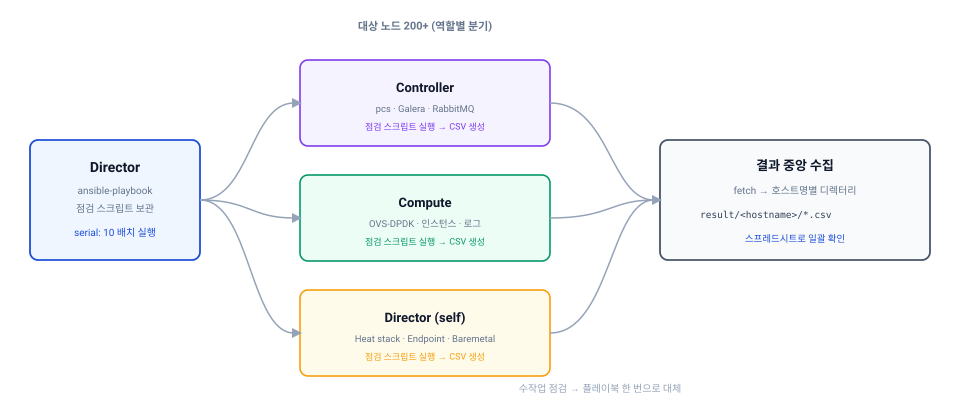

노드가 열 대일 때는 정기점검이 그냥 번거로운 일입니다. 200대를 넘어가면 **아예 불가능한 일**이 됩니다.

한 대당 확인 항목이 10개가 넘고, 노드 역할마다 봐야 할 것이 다릅니다. 손으로 하면 며칠이 걸리고, 그렇게 모은 결과는 형식이 제각각이라 비교도 안 됩니다.

국내 통신사 5G 코어 인프라를 운영하면서 이 문제를 Ansible로 풀었던 기록입니다.

> **표기에 관하여**
> 이 글의 IP, 호스트명, 경로는 모두 예시 값으로 바꾼 것입니다.
> `192.168.100.x` / `rhosp-cluster1-comp-node01` 처럼 실제 운영 환경과 무관한 값을 썼고,
> 고객사 보안 구성에 해당하는 부분은 코드를 싣지 않았습니다. 구조와 접근 방식만 참고해 주세요.

## 1. 문제 정의

점검 자체는 어렵지 않습니다. 어려운 건 규모입니다.

| 항목 | 수작업 시 |
|---|---|
| 대상 노드 | 200대 이상 |
| 노드당 확인 항목 | 10개 이상 |
| 역할 구분 | Director / Controller / Compute 각각 다름 |
| 결과 취합 | 사람마다 형식이 다름 |
| 재현성 | 점검자에 따라 누락 발생 |

특히 **결과 취합이 진짜 문제**였습니다. 점검은 어떻게든 하는데, 200개 노드의 결과를 한눈에 비교할 방법이 없으면 이상 징후를 못 찾습니다.

## 2. 설계 방향

세 가지를 나눠서 생각했습니다.

| 역할 | 담당 |
|---|---|
| 무엇을 점검할지 | Bash 스크립트 (노드에서 실행) |
| 어떻게 뿌리고 돌릴지 | Ansible 플레이북 |
| 결과를 어떻게 모을지 | Ansible `fetch` + 호스트명 디렉터리 |

**점검 로직을 Ansible 태스크로 쓰지 않고 Bash 스크립트로 분리한 것이 핵심**입니다. 점검 항목은 자주 바뀌는데, 그때마다 플레이북을 고치면 관리가 어렵습니다. 스크립트만 교체하면 되도록 했습니다.

그리고 결과를 **CSV로 뽑았습니다.** 텍스트 로그로 남기면 결국 사람이 읽어야 하는데, CSV면 스프레드시트에 200개를 붙여놓고 열 단위로 훑을 수 있습니다.

[](inspection-flow.svg "클릭하면 원본 크기로 열립니다")

## 3. 플레이북 구조

전체 흐름은 단순합니다. 배포 → 권한 → 실행 → 수집.

```yaml
---
- name: RHOSP Maintenance check playbook
  hosts: all
  serial: 10
  gather_facts: yes

  tasks:
    - name: Copy maintenance script to remote server
      copy:
        src: /home/stack/scripts/rhosp-maintenance.sh
        dest: /home/heat-admin/rhosp-maintenance.sh
      when: '"comp" in ansible_hostname or "osc" in ansible_hostname'

    - name: Change owner
      command: chown -R heat-admin:heat-admin /home/heat-admin/rhosp-maintenance.sh
      when: '"comp" in ansible_hostname or "osc" in ansible_hostname'

    - name: Change permission
      command: chmod 755 /home/heat-admin/rhosp-maintenance.sh
      when: '"comp" in ansible_hostname or "osc" in ansible_hostname'

    - name: Execute maintenance script
      command: /home/heat-admin/rhosp-maintenance.sh
      when: '"comp" in ansible_hostname or "osc" in ansible_hostname'
```

### `serial: 10` — 한꺼번에 돌리지 않는 이유

200대에 동시에 붙으면 두 가지가 터집니다.

| 문제 | 내용 |
|---|---|
| Director 부하 | SSH 커넥션 200개를 동시에 감당하지 못함 |
| 운영 영향 | 점검 스크립트가 `top`, `virsh`, `openstack` 명령을 돌리므로 동시 실행 시 부하 발생 |

`serial: 10`으로 10대씩 순차 처리하면 전체 시간은 늘어나지만 **안정적으로 끝까지 돕니다.** 자동화에서 중요한 건 속도가 아니라 완주율입니다.

### 호스트명으로 역할 구분

RHOSP 인벤토리는 역할별 그룹이 있지만, 실제로는 호스트명 규칙이 더 확실했습니다.

```yaml
when: '"comp" in ansible_hostname'      # 컴퓨트
when: '"osc" in ansible_hostname'       # 컨트롤러
when: '"director" in ansible_hostname'  # 배포 노드
```

Director는 경로와 계정이 달라서(`/home/stack`, `stack` 계정) 별도 태스크로 분기했습니다.

## 4. 결과 수집

여기가 이 플레이북의 핵심입니다.

```yaml
    - name: Find result file
      find:
        paths: "/home/heat-admin"
        age: -3600
        age_stamp: mtime
        recurse: yes
        patterns: "*.csv"
      register: files_to_copy

    - name: Copy result files to director
      fetch:
        src: "{{ item.path }}"
        dest: /home/stack/maintenance-result/{{ ansible_hostname }}/
        flat: yes
      with_items: "{{ files_to_copy.files }}"
```

두 가지가 중요합니다.

**`age: -3600`** — 1시간 이내에 수정된 파일만 찾습니다. 이걸 안 걸면 지난달 점검 결과까지 딸려옵니다.

**`{{ ansible_hostname }}` 디렉터리** — 결과를 호스트명별로 나눠 담습니다. `flat: yes`를 함께 써야 원격 경로 구조가 그대로 복제되지 않고 파일만 떨어집니다.

```
maintenance-result/
├── rhosp-cluster1-osc-node01/
│   └── rhosp-cluster1-osc-node01-maintenance-2026082914.csv
├── rhosp-cluster1-comp-node01/
│   └── rhosp-cluster1-comp-node01-maintenance-2026082914.csv
├── rhosp-cluster1-comp-node02/
│   └── rhosp-cluster1-comp-node02-maintenance-2026082914.csv
└── ...
```

## 5. 점검 스크립트

노드에서 실제로 도는 부분입니다. 공통 항목을 먼저 찍고, 역할별로 분기합니다.

### 공통 항목

```bash
uptime | cut -d ',' -f1 | cut -d ' ' -f3-
top -b -n1 | grep -Po '[0-9.]+ id' | awk '{ print 100-$1, "%" }'
free -h | grep ^Mem | awk '{ print 100 * ($2 - $7) / $2, "%" }'
df -h | egrep -v "Filesystem|devtmpfs|tmpfs" | awk '{ print $6 " : " $5 }'
sudo cat /var/log/messages | egrep -i 'fail|error' | wc -l
cat /proc/net/bonding/bond{0,1,2,3} 2>/dev/null | grep -B 1 Status
sudo ip -f inet -o addr | grep -v 127.0.0.1 | awk '{ print $2, $3, $4 }'
sudo route -n

# 클러스터별 게이트웨이 도달성 확인
if [ -n "`hostname | grep -i cluster1-comp`" ]; then
    ping -c 2 192.168.100.11
elif [ -n "`hostname | grep -i cluster2-comp`" ]; then
    ping -c 2 192.168.100.41
fi

sudo ntpq -pn | sed '1,2d' | awk '{ print $1 }'
```

부하·메모리·디스크 같은 기본 항목에 더해 **bond 상태와 NTP 동기화**를 넣었습니다. 통신사 환경에서는 본딩이 한쪽 다리로 버티고 있는 상태를 조기에 잡는 게 중요하고, NTP는 틀어지면 인증부터 깨집니다.

### 컨트롤러

```bash
sudo pcs status
sudo docker exec rabbitmq-bundle-docker-0 \
  bash -c "rabbitmqctl cluster_status" | tr ',"' '  ' | grep parti
sudo docker exec galera-bundle-docker-0 \
  bash -c 'mysql -uroot -e "show global status"' \
  | egrep "wsrep_local_state_comment|wsrep_cluster_size"

source ~/overcloudrc
openstack compute service list | grep -o up | wc -l
openstack network agent list | grep -o ':-)' | wc -l
```

Pacemaker 상태, RabbitMQ 파티션 여부, **Galera 클러스터 크기와 동기화 상태**를 봅니다. `wsrep_cluster_size`가 3이 아니면 그 시점에 이미 문제입니다.

서비스 목록은 개수를 세는 방식으로 처리했습니다. 전체 목록을 CSV에 넣으면 셀이 감당을 못 하고, 결국 보고 싶은 건 "다 살아 있나"이기 때문입니다.

### 컴퓨트

```bash
sudo virsh list --all | grep running | wc -l
sudo systemctl status openvswitch | egrep "Loaded: | Active: "
sudo ovs-appctl bond/show | grep "slave dpdk"

cat /var/log/containers/nova/nova-compute.log | egrep -i "fail|error" | wc -l
cat /var/log/containers/neutron/openvswitch-agent.log | egrep -i "fail|error" | wc -l
```

인스턴스 수, OVS 상태, **DPDK 본딩 슬레이브 상태**를 확인합니다. 로그는 전문을 담지 않고 에러 라인 수만 셉니다. 숫자가 평소와 다른 노드만 따로 들여다보면 됩니다.

### 디렉터

```bash
source ~/stackrc
openstack stack list | grep -o UPDATE_COMPLETE
sudo systemctl list-units openstack-* | grep -o "loaded active running" | wc -l
openstack endpoint list | grep -o True | wc -l
openstack baremetal node list | awk '{ print $8 $9 ", " $11 ", " $13 }' \
  | grep "poweron, active, False" | wc -l
```

Heat 스택 상태, undercloud 서비스, 엔드포인트, 베어메탈 노드 상태를 봅니다.

### CSV로 뽑기

각 명령 결과 사이에 구분자를 넣어 한 줄짜리 CSV로 만듭니다.

```bash
function output {
  if [ ${1} == "wide" ]; then
      echo -e "\",\""
  fi
}

function check_command {
  echo ",\""
  uptime | cut -d ',' -f1 | cut -d ' ' -f3-
  output ${1}
  # ... 이하 항목 반복
  echo "\""
}

check_command wide > `hostname`-maintenance-$(date +%Y%m%d%H).csv
```

전체를 큰따옴표로 감싸고 항목 사이에 `","`를 넣는 방식입니다. 명령 출력에 줄바꿈이 있어도 한 셀 안에 들어갑니다.

## 6. 같은 구조를 보안조치에도

정기점검이 자리를 잡은 뒤, **OS 보안취약점 조치도 같은 틀로 옮겼습니다.**

신규 구축이나 재구축한 노드에는 보안 조치 절차를 적용해야 하는데, 이것도 노드마다 손으로 하던 일이었습니다. 조치 항목이 열 가지가 넘고 마지막에 결과를 증빙으로 제출해야 해서 실수가 나기 쉬웠습니다.

> 이 부분의 플레이북과 조치 항목은 고객사 보안 구성에 해당해 공개하지 않습니다.
> 아래는 코드 없이 설계 관점만 정리한 것입니다.

### 다섯 단계로 나눈 이유

플레이북을 단일 파일이 아니라 다섯 단계로 쪼개고 `include_tasks`로 묶었습니다.

| 단계 | 성격 |
|---|---|
| 1 | 노드 기본 설정 |
| 2 | 조치 절차 실행 |
| 3 | 운영 계정 및 권한 구성 |
| 4 | 결과 파일 수집 |
| 5 | 조치 결과 검증 및 요약 |

단일 파일로 만들면 **특정 단계만 다시 돌릴 수가 없습니다.** 3단계에서 실패했을 때 1~2단계를 건너뛰고 재실행해야 하는데, 파일이 나뉘어 있으면 메인 플레이북에서 해당 줄만 남기면 됩니다. 200대 규모에서는 "일부 노드만 특정 단계 재실행"이 수시로 발생합니다.

### 조치와 검증을 분리한 것

5단계가 정기점검에서 배운 것입니다. **조치를 실행했다는 것과 조치가 적용됐다는 것은 다릅니다.**

플레이북이 성공으로 끝나도 실제 값이 안 바뀐 경우가 있습니다. 명령은 돌았는데 대상 파일이 없었다거나, 패키지가 이미 다른 버전이었다거나 하는 식입니다. 그래서 조치가 끝난 뒤 **실제 상태를 다시 읽어 요약 파일로 남기고, 그 파일까지 수집**하도록 했습니다.

효과는 두 가지였습니다.

| 항목 | 내용 |
|---|---|
| 누락 발견 | 200개 요약 파일을 훑으면 조치가 안 된 노드가 바로 드러남 |
| 검수 대응 | "조치했습니다"가 아니라 "이 파일이 증거입니다"로 제출 |

두 번째가 실무에서 특히 컸습니다. 증빙 자료를 만드는 데 들던 시간이 사라졌습니다.

### 정기점검과 공유한 구조

| 요소 | 정기점검 | 보안조치 |
|---|---|---|
| 실행 단위 | 노드에서 스크립트 | 노드에서 단계별 태스크 |
| 결과 형식 | CSV | 요약 텍스트 |
| 수집 방식 | `find` + `fetch` | 동일 |
| 저장 위치 | 호스트명별 디렉터리 | 동일 |

**수집 구조를 그대로 재사용한 것이 핵심입니다.** 결과를 어디에 어떤 이름으로 모을지 한 번 정해두면, 다른 반복 작업을 자동화할 때 그 부분은 다시 고민하지 않아도 됩니다.

## 7. 걸렸던 부분

**`age` 조건이 없으면 과거 결과가 섞입니다.** 처음에는 `patterns: "*.csv"`만 걸었다가, 이전 회차 파일까지 가져와서 어느 게 이번 것인지 알 수 없었습니다.

**`fetch`는 느립니다.** 파일 하나당 커넥션을 새로 쓰기 때문에 노드가 많으면 수집 시간이 실행 시간보다 길어집니다. 파일 개수를 최소화하는 편이 낫습니다.

**결과 형식을 먼저 정해야 합니다.** 스크립트를 먼저 짜고 CSV 형식을 나중에 맞추려니 출력마다 줄바꿈 처리가 제각각이라 고생했습니다. **어떤 표를 보고 싶은지부터 정하고 거꾸로 내려오는 게 맞습니다.**

**`command`와 `shell`을 구분해야 합니다.** 파이프나 리다이렉션이 들어가면 `command`로는 안 됩니다. 초반에 이걸 헷갈려서 조용히 실패하는 태스크가 있었습니다.

## 8. 정리

| 항목 | 수작업 | 자동화 |
|---|---|---|
| 실행 | 노드마다 접속 | 플레이북 1회 |
| 점검 항목 | 사람마다 편차 | 스크립트로 고정 |
| 결과 형식 | 제각각 | CSV 통일 |
| 결과 위치 | 흩어짐 | Director 한 곳 |
| 이력 관리 | 없음 | 회차별 파일로 축적 |

자동화의 실익은 시간 절약보다 **점검의 품질이 일정해진다는 데 있습니다.** 누가 하든 같은 항목을 같은 방식으로 보고, 결과가 같은 형식으로 남습니다. 200대 규모에서는 이게 훨씬 중요합니다.

그리고 결과가 CSV로 쌓이면 **회차 간 비교**가 가능해집니다. 이번 달에 로그 에러 수가 갑자기 늘어난 노드를 찾는 식의 분석은 수작업 점검으로는 애초에 불가능한 일입니다.

---

**저장소**

이 글의 플레이북과 점검 스크립트를 일반 OpenStack 환경에서 동작하도록 정리해 올려두었습니다.
호스트명 규칙에 의존하던 역할 판별을 자동 판별로 바꾸고, 경로와 인증 정보를 변수로 뺐습니다.

- [hkjeon/openstack-ops — maintenance](https://github.com/hkjeon/openstack-ops/tree/main/maintenance)
