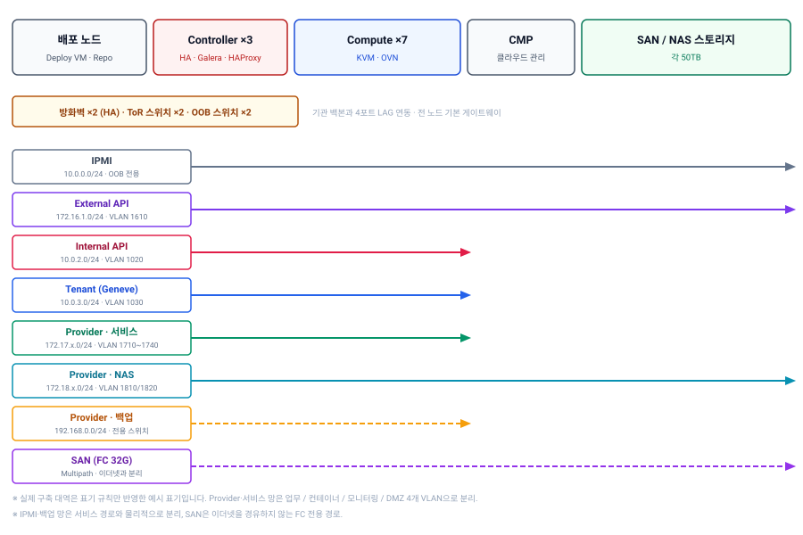
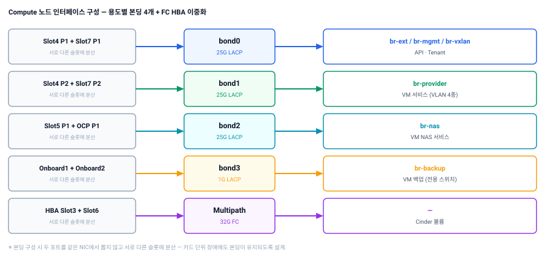

## 개요

| 항목 | 내용 |
|---|---|
| 발주처 | 국가 시험인증기관 |
| 기간 | 2025.04 ~ 2025.11 (설계 2025.06 · 구축 완료 2025.09) |
| 역할 | 클라우드 아키텍처 설계 · 구축 · 산출물 작성 |
| 대상 | 기관 업무시스템 전용 프라이빗 클라우드 (IaaS + PaaS) |
| 구성 | 2 Rack, 베어메탈 12대 (Controller 3 / Compute 7 / 배포 1 / CMP 1), SAN·NAS 각 50TB |
| 기술 | OpenStack Caracal (2024.1), OVN, Ubuntu 22.04, FC SAN Multipath, Kubernetes 1.30 |

기존에 물리 서버로 흩어져 있던 기관의 업무시스템을 한 클러스터 위로 모으는 사업입니다. 설계 단계부터 참여해 아키텍처정의서와 시스템구축결과서를 직접 작성했고, 실제 구축과 업무시스템 이관까지 수행했습니다.

## 과제

**1. 인터넷이 없는 환경에서의 구축**

기관 내부망은 외부 연결이 차단된 폐쇄망입니다. OpenStack은 설치 과정에서 OS 패키지와 Python 패키지를 대량으로 내려받는데, 이 경로가 전부 막혀 있는 상태에서 배포해야 했습니다.

**2. 성격이 전혀 다른 트래픽이 한 클러스터에 모임**

ERP, 그룹웨어, 웹메일, 대외 공개 홈페이지, CI/CD, 화학물질관리시스템이 같은 클러스터를 씁니다. 여기에 인프라 관리 트래픽, VM 백업 트래픽, NAS 트래픽, 스토리지 트래픽까지 겹칩니다. **대외 서비스와 내부 업무가 같은 물리 인프라를 공유하되 경로는 분리돼야 한다**는 것이 전제였습니다.

**3. 운영 중인 업무시스템을 IP 유지한 채 이관**

이관 대상 11종은 이미 기관 직원들이 매일 쓰는 시스템입니다. 방화벽 정책, DNS, 연동 시스템이 기존 IP를 기준으로 짜여 있어 **서비스 IP를 그대로 가져가야** 했습니다.

## 수행 내용

### 용도별 8개 망 분리

물리 인프라는 공유하되, 트래픽 성격별로 논리 망을 나눴습니다.

| 망 | 대역 | 용도 |
|---|---|---|
| IPMI | `10.0.0.0/24` | 서버 전원 제어 · OOB 관리 (서비스망과 완전 분리) |
| External API | `172.16.1.0/24` | Horizon, CMP·스토리지 API 연동 |
| Internal API | `10.0.2.0/24` | OpenStack 서비스 간 통신 (DB, RPC) |
| Tenant | `10.0.3.0/24` | 인스턴스 간 오버레이 (Geneve) |
| Provider (서비스) | `172.17.x.0/24` ×4 | 업무 서비스 · 컨테이너 · 통합모니터링 · DMZ를 VLAN으로 각각 분리 |
| Provider (NAS) | `172.18.x.0/24` ×2 | 클러스터용 NAS와 VM 제공용 NAS를 분리 |
| Provider (백업) | `192.168.0.0/24` | VM 백업 전용 (백업 솔루션 직결) |
| SAN | FC 32G | Cinder 볼륨 전용 (이더넷과 물리적으로 분리) |

특히 **Provider network를 목적별로 4개 VLAN으로 쪼갠 것**이 핵심입니다. 대외 공개 홈페이지는 DMZ VLAN에, 내부 업무 시스템은 서비스 VLAN에, 컨테이너 플랫폼과 통합모니터링은 각각 별도 VLAN에 둡니다. 방화벽에서 VLAN 단위로 정책을 걸 수 있어 **업무 하나가 추가될 때 네트워크 설계를 다시 하지 않아도 되는 구조**입니다.

### Compute 노드의 4-Bond 구성

Compute 노드 한 대에 물리 포트가 많이 붙습니다. 이를 용도별 본딩 4개로 정리했습니다.

| Bond | 대역폭 | 브리지 | 용도 |
|---|---|---|---|
| bond0 | 25G LACP | `br-ext` / `br-mgmt` / `br-vxlan` | API · Tenant |
| bond1 | 25G LACP | `br-provider` | VM 서비스 (VLAN 4종) |
| bond2 | 25G LACP | `br-nas` | VM NAS 서비스 |
| bond3 | 1G LACP | `br-backup` | VM 백업 |
| HBA | 32G FC ×2 | — | Cinder 볼륨 (Multipath) |

본딩을 구성할 때 **두 포트를 같은 NIC에서 뽑지 않고 서로 다른 슬롯에 분산**했습니다. 카드 하나가 죽어도 본딩이 살아 있어야 이중화가 의미를 갖습니다. 포트 하나가 빠지는 장애보다 카드 전체가 빠지는 장애가 실제로는 더 자주 발생합니다.

백업 트래픽을 1G 별도 본딩으로 뺀 것도 의도적입니다. 백업은 야간에 대역폭을 크게 점유하는데, 서비스망과 섞이면 업무 시간대에 영향을 줄 수 있습니다. 전용 스위치와 직결해 경로 자체를 분리했습니다.

### 폐쇄망 배포 체계

배포 노드 위에 KVM으로 Deploy VM을 올리고, 그 안에 설치에 필요한 저장소를 전부 컨테이너로 구성했습니다.

| 구성 요소 | 역할 |
|---|---|
| Apache | Ubuntu 22.04 APT 저장소 미러 |
| PyPI Server | Python 패키지 저장소 |
| Git | 배포 플레이북 저장소 |
| Ansible | 배포 자동화 |

여기에 **OS 전체 패키지 저장소를 별도 VM으로 하나 더 구성**했습니다. 설치가 끝나고 운영에 들어간 뒤에도 패키지 설치와 보안 업데이트를 폐쇄망 안에서 할 수 있어야 하기 때문입니다. 구축 시점만 해결하는 미러와 운영 기간 내내 쓰는 미러는 요구사항이 다릅니다.

OpenStack은 컨테이너 배포가 아닌 **베어메탈 설치 방식**을 택했습니다. 기관 담당자가 인수인계 후 직접 운영해야 하는 환경에서는 설정 파일과 로그가 호스트 파일시스템에 그대로 보이는 쪽이 유지보수에 유리하다고 판단했습니다.

### 고가용성 구성

| 계층 | 구성 |
|---|---|
| Controller | 3중화 |
| 데이터베이스 | Galera Cluster 3중화 |
| API 엔드포인트 | HAProxy + Keepalived VIP |
| 네트워크 | 방화벽 HA, ToR 2대, OOB 2대, 백본 4포트 LAG |
| 스토리지 | SAN Switch 2대 + FC Multipath, NAS 컨트롤러 A/Standby |
| 전원 | Rack별 UPS |

DB 백업은 NAS로 Full 백업 후 7일 보관 정책을 걸었습니다. 스토리지가 이중화돼 있어도 **논리적 장애(잘못된 삭제, 마이그레이션 실패)는 이중화로 막을 수 없기** 때문에 별도 백업 경로가 필요합니다.

### 스토리지 이원화

| 타입 | 연결 | 용량 | 용도 |
|---|---|---|---|
| SAN | FC 32G Multipath | 50TB | VM 볼륨, Glance 이미지 |
| NAS | 25G LACP (NFS) | 50TB | OS 패키지 미러, DB 백업, 컨테이너 레지스트리·PV, ERP·웹메일·모니터링 데이터 |

Flavor는 **Disk를 0으로 정의**했습니다. 외부 스토리지를 Cinder 백엔드로 쓸 때 Flavor에 디스크 값을 주면 Compute 로컬 디스크에 임시 영역이 잡혀 의도와 다르게 동작합니다. 볼륨 기반으로 VM을 생성하는 구조에서는 Disk=0이 맞습니다.

NAS는 컨트롤러 포트를 Bond0(클러스터용)과 Bond1(VM 서비스용)으로 나눠 **인프라가 쓰는 NAS와 VM이 쓰는 NAS의 경로를 분리**했습니다. VM 쪽에서 대용량 파일 I/O가 발생해도 DB 백업 경로가 영향을 받지 않습니다.

### VM 기반 Kubernetes 플랫폼

IaaS 위에 컨테이너 플랫폼을 별도로 얹었습니다. 베어메탈이 아닌 **OpenStack VM 위에 구성**해, 노드 증설과 재구성을 물리 작업 없이 할 수 있게 했습니다.

| 구성 | 내용 |
|---|---|
| 클러스터 | Common (공통 서비스) / Dev (업무 배포) 2개 분리 |
| 로그 | OpenSearch 클러스터 (Master 3 + Data 3), Fluent Bit 수집 |
| 이미지 | 사설 레지스트리 (폐쇄망 대응) |
| 배포 | GitOps 기반 자동 배포 + 파이프라인 |
| 관측 | Prometheus · Grafana · Alertmanager, Service Mesh 추적 |
| 백업 | 클러스터 백업·복구 도구 구성 |
| 진입 | HAProxy 3대 — 클러스터 API / Common / Dev 트래픽을 각각 분리 |

### 업무시스템 이관

| 구분 | 이관 대상 |
|---|---|
| 기간계 | ERP WAS 2대, 그룹웨어, SSO |
| 메일 | 웹메일, 스팸 차단 |
| 대외 | 공개 홈페이지, 온라인 상담 플랫폼 |
| 기반 | DNS, CI/CD, 화학물질관리시스템 |

VM은 Provider network에 직접 붙는 구조라 **기존 서비스 IP를 그대로 유지**했습니다. 각 VM의 서비스 IP와 방화벽 NAT IP, 허용 포트를 표로 사전 정리해두고 이관 후 동일하게 재현되는지 대조했습니다. 이 NAT 매핑 표가 이후 운영 단계에서 방화벽 정책 변경의 기준 문서가 됐습니다.

프로젝트는 업무 성격에 따라 셋으로 나누고 Quota를 걸었습니다.

| 프로젝트 | 용도 | VM |
|---|---|---|
| 클라우드 서비스 | 기관 업무시스템 | 13 |
| 컨테이너 서비스 | Kubernetes 플랫폼 | 19 |
| 통합 모니터링 | 인프라·VM 감시 | 21 |

Quota는 산정 자원의 150%로 잡았습니다. 100%로 맞추면 일시적인 스케일 업이나 재생성 과정에서 한도에 걸려 작업이 멈춥니다. 여유를 두되 물리 자원은 넘지 않는 선이 실무에서 쓸 수 있는 값입니다.

## 결과

| 항목 | 내용 |
|---|---|
| 가용 자원 | vCPU 2,688 (CPU 4:1 오버커밋) / 메모리 7TB |
| 이관 | 업무시스템 11종, 서비스 IP 유지 |
| 망 분리 | 용도별 8개 망, Provider VLAN 4종으로 업무 구간 분리 |
| 플랫폼 | IaaS(OpenStack) + PaaS(Kubernetes 2 클러스터) 동시 제공 |
| 산출물 | 아키텍처정의서 · 시스템구축결과서 작성 (네트워크 포트맵, IP·NAT 설계 포함) |

## 배운 것

**메모리 오버커밋은 1.0으로 두는 편이 낫습니다.**

CPU는 4:1로 잡았지만 메모리는 1:1로 설정했습니다. CPU는 순간적으로 경합해도 성능이 느려질 뿐이지만, **메모리는 부족하면 VM이 죽습니다.** 업무시스템이 올라가는 환경에서 메모리 오버커밋은 이득보다 위험이 큽니다. 여기에 호스트 운영용으로 노드당 32GB를 예약해뒀습니다.

**포트맵은 구축 산출물이 아니라 운영 자산입니다.**

구축 완료 후 기관 백본 스위치가 교체되면서 연결 포트가 전부 바뀌는 일이 있었습니다. 이때 포트맵 문서를 갱신하는 것만으로 변경 범위를 정확히 파악할 수 있었습니다.

어느 장비의 몇 번 포트가 어디에 연결되는지를 표로 남겨두면, **나중에 그 문서를 보는 사람이 현장에 가지 않고도 판단**할 수 있습니다. 구축이 끝나는 시점에 문서를 닫아두지 않고 변경이 생길 때마다 개정하는 습관이 결국 운영 비용을 줄입니다.

**분리의 기준은 보안이 아니라 장애 영향 범위입니다.**

망을 8개로 나눈 것은 보안 요구사항 때문만이 아닙니다. 백업 트래픽이 서비스에 영향을 주지 않게, VM의 NAS I/O가 DB 백업 경로를 막지 않게, 관리 트래픽이 서비스 장애 때도 살아 있게 하려는 것입니다.

**"어디가 죽으면 무엇까지 같이 죽는가"**를 먼저 그려보면, 분리해야 할 지점이 보안 요구사항보다 먼저 드러납니다.
