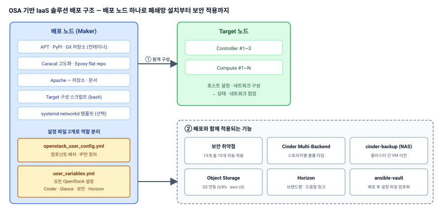

{}


9개|고도화 항목 직접 수행
10 / 13|보안 취약점 배포 시 자동 적용
2종|노드 구성 방식 (bash · systemd-networkd)
Epoxy|폐쇄망 패키지 직접 구성 (OSA 31.x)


## 프로젝트 개요

| 항목 | 내용 |
|---|---|
| 소속 | N사 (IaaS 솔루션 개발) |
| 기간 | 2024.10 ~ 2026.07 |
| 대상 | OpenStack-Ansible 기반 **자사 IaaS 솔루션 배포 패키지** — Caracal 패키지 기능 고도화, **Epoxy 패키지 신규 구성** |
| 목적 | 구축 현장마다 반복되던 수작업을 줄이고, 고객 요구 기능을 **패키지 기능**으로 표준화 |
| 기술 | OpenStack-Ansible Caracal (Ubuntu 22.04) · Epoxy 31.x (Ubuntu 24.04) · Ansible · bash · systemd-networkd · Cinder · Horizon · ansible-vault |

## 구축 형태

| 구분 | 구성 |
|---|---|
| 배포 노드 | APT(apache) · PyPI(pypiserver) · Git(git-daemon) 컨테이너를 담은 **배포 노드(Maker)** 하나로 폐쇄망 설치 |
| 노드 구성 | Target 노드 설정 · 네트워크 구성을 배포 노드에서 **원격 실행** 후 점검 |
| 설정 구조 | `openstack_user_config.yml` = 컴포넌트 · IP만 / `user_variables.yml` = 모든 OpenStack 설정 |
| 적용 기능 | 보안 취약점 자동 적용, Cinder Multi-Backend, cinder-backup(NAS), S3 연동, Horizon 커스텀, 설정 암호화 |

## 구성도

## 담당 역할 및 수행 내용

**역할** 배포 패키지 구조 설계 및 기능 고도화 (아래 9개 항목 직접 수행)

| 항목 | 개선 전 문제 | 수행 내용 |
|---|---|---|
| Epoxy 오프라인 패키지 | Caracal은 업스트림 도메인별 미러 트리라 **저장소 경로가 길고 복잡** | Epoxy(OSA 31.x · Ubuntu 24.04) 패키지를 새로 구성 — APT를 **flat repo**(`main` + MariaDB · RabbitMQ · Erlang 분리)로 단순화, `user_variables`의 repo 경로 표준화 |
| 노드 구성 자동화 | 노드마다 스크립트를 복사해 **직접 실행하는 반복 작업** | bash 기반 Target 노드 설정 · 네트워크 구성 자동화, systemd-networkd 방식도 별도 구현 ([관련 글](/blog/osa-systemd-networkd/)) |
| 설정 파일 구조 | 설정이 두 파일에 섞여 나열 · 반복 작성 | **user_config는 컴포넌트 · IP만, 설정은 모두 user_variables로** 원칙 수립, Cinder · Glance 설정 분리 |
| 보안 취약점 | 구축 후 수작업 조치 | 클라우드 보안 취약점 **13개 중 10개를 배포 시 자동 적용** |
| cinder-backup | 클러스터 간 VM 이전 절차가 복잡 | cinder-backup **NAS 백엔드 연동 · 백업 저장까지 검증** |
| Cinder Multi-Backend | 두 스토리지를 독립적으로 쓸 방법 필요 | 스토리지별 볼륨 타입 구성, 벤더별 연동 템플릿 내재화 ([공공 인프라 사례](/projects/public-dcn-multicluster/)) |
| Object Storage | VM에서 S3 스토리지 사용 요구 | 외부 Object Storage 연동 — s3fs 마운트 · aws cli 호환 검증 |
| Horizon 커스텀 | 제품 식별 · 안내 부족 | 브랜드명 표시, 도움말 링크 연동 (운영 매뉴얼 PDF 연동까지 구현 → 요청에 따라 솔루션 소개 페이지로 변경) |
| 설정 암호화 | 구축 후 설정 정보 유출 우려 | ansible-vault로 배포 템플릿 암호화 · 복호화 절차 구성 |

## 기타

- 실제 구축 현장에서는 bash 방식을 선호해 두 방식을 모두 유지 — 현장 운영자 편의에 맞춘 선택지 제공

{}
