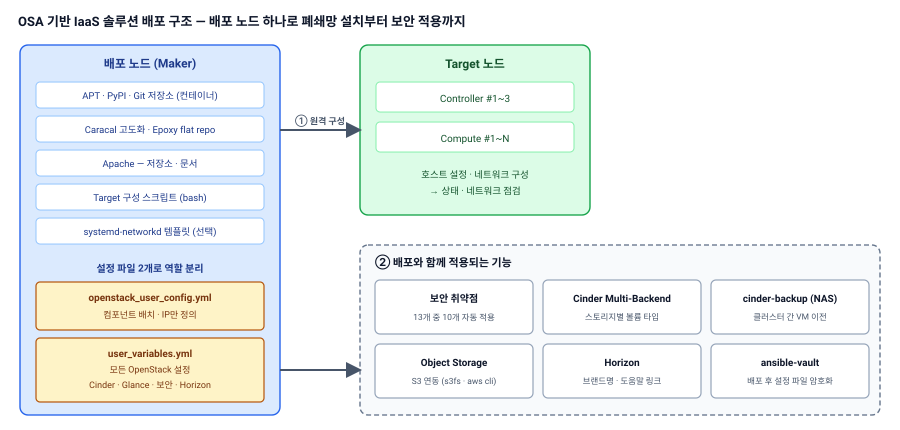

{}

**한 줄 요약** 구축 현장마다 손으로 하던 설치 · 설정 작업을 **제품 기능으로 바꿨고**, 그 과정에서 찾은 OpenStack 문제는 **업스트림에 고쳐 올렸습니다.**


9개|제품 기능 직접 개발 · 개선
10 / 13|보안 취약점 설치 시 자동 조치
Epoxy|폐쇄망 설치 패키지 신규 구성
2건|OpenStack 공식 반영 (직접 머지 1 · 제안 반영 1)


## 프로젝트 개요

| 항목 | 내용 |
|---|---|
| 소속 · 기간 | N사 (IaaS 솔루션 개발) · 2024.10 ~ 2026.07 |
| 대상 | OpenStack-Ansible 기반 **자사 IaaS 솔루션 설치 패키지** |
| 목표 | 현장마다 반복되던 수작업을 줄이고, 고객 요구를 **제품 기능으로 표준화** |

## 구성도

## 무엇을 했나

### ① 설치를 단순하게

| 한 일 | 효과 |
|---|---|
| **Epoxy 설치 패키지** 새로 구성 | 인터넷이 막힌 고객 환경에서도 그대로 설치. 저장소 구조를 단순화해 관리가 쉬워짐 |
| **노드 설정 자동화** (bash · systemd-networkd) | 서버마다 접속해서 하던 설정을 배포 노드에서 **한 번에** 처리 |
| **설정 파일 역할 분리** | "서버 배치 · IP"와 "기능 설정"을 나눠, 고객마다 바꿀 곳이 한눈에 보임 |

### ② 운영을 안전하게

| 한 일 | 효과 |
|---|---|
| **보안 취약점 자동 조치** | 13개 점검 항목 중 10개를 **설치와 동시에** 적용 |
| **설정 파일 암호화** | 구축이 끝난 뒤 설정 정보가 밖으로 새지 않도록 보호 |
| **백업 연동** (NAS) | VM 디스크를 백업해 다른 클러스터로 옮길 수 있게 함 |

### ③ 고객 요구를 기능으로

| 한 일 | 효과 |
|---|---|
| **스토리지 2종 동시 사용** | 서로 다른 스토리지를 용도별로 나눠 사용 ([공공 인프라 사례](/projects/public-dcn-multicluster/)) |
| **S3 오브젝트 스토리지 연동** | VM에서 S3 저장소를 바로 사용 |
| **관리 화면 커스텀** | 제품명 표시, 도움말 링크 연결 |

### ④ 업스트림 기여 — 현장에서 찾은 문제를 OpenStack에 반영

| 문제 | 해결 | 결과 |
|---|---|---|
| SSH 포트를 바꾸면 **인증 키 동기화가 실패**해 주기적 에러 | 포트를 설정값으로 바꿀 수 있게 코드 제안 → **실제 고객 환경에 적용** | 제안 (2025.05) [이슈](https://answers.launchpad.net/openstack-ansible/+question/821851) · [버그 리포트](https://bugs.launchpad.net/openstack-ansible/+bug/2110943) |
| 컨테이너 서비스(Zun)의 **웹 콘솔이 보안 정책에 막혀** 화면이 안 나옴 | 문제 보고 · 해결 방안 제안 → 메인테이너가 패치 작성 → **테스트 · 검증 결과 공유** | ✅ **공식 반영** (2026.04) [이슈](https://answers.launchpad.net/openstack-ansible/+question/824034) · [버그 리포트](https://bugs.launchpad.net/openstack-ansible/+bug/2147415) · [변경 내역](https://review.opendev.org/c/openstack/openstack-ansible/+/983525) |
| 스토리지 서비스(Swift)가 **권한 오류로 시작되지 않음** | 버그 보고 · 조치 제안 → 수정 코드 **직접 제출** (Zun 건 이후 메인테이너 안내로 직접 기여) | ✅ **공식 반영** (2026.04) [버그 보고](https://answers.launchpad.net/openstack-ansible/+question/824067) · [변경 내역](https://review.opendev.org/c/openstack/openstack-ansible-os_swift/+/984906) |

{}

RedHat 레드햇 레드헷 오픈스택 OpenStack 클라우드 프라이빗클라우드 IaaS OSA OpenStack-Ansible 오픈스택앤서블 Ansible 앤서블 업스트림 오픈소스 기여 Gerrit 제품개발 패키지 Zun 컨테이너 콘솔 HAProxy Swift Keystone
