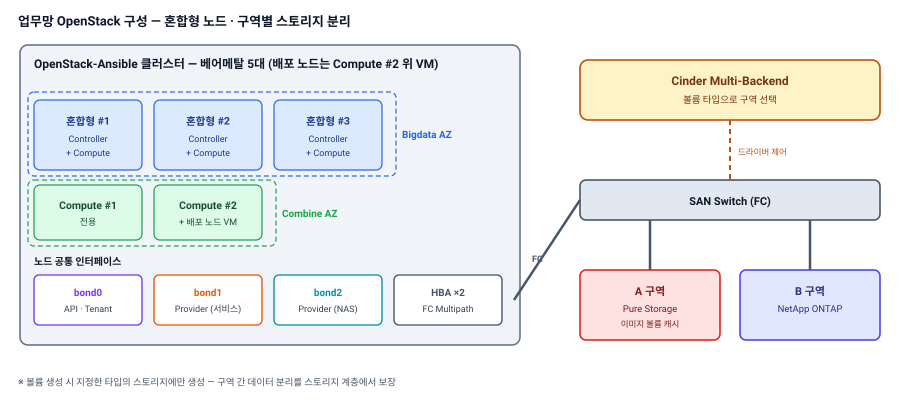

{}


5대|베어메탈 (혼합형 3 · Compute 2)
2종|벤더 스토리지 구역별 분리
9대|운영 VM 이관 (IP 유지)
KA → OSA|배포 도구 전환 재구축


## 프로젝트 개요

| 항목 | 내용 |
|---|---|
| 발주처 | 공공 인프라 공기업 |
| 기간 | 2024.12 ~ 2025.05 |
| 사업 | 운영 중인 Kolla-Ansible 기반 업무망 OpenStack을 **OpenStack-Ansible 기반으로 재구축**하고 기존 VM 이관 |
| 규모 | 베어메탈 5대 (혼합형 3 + Compute 2), 배포 노드 VM, AZ 2개 (Bigdata · Combine) |
| 기술 | OpenStack-Ansible · Cinder Multi-Backend · FC Multipath · Pure Storage · NetApp ONTAP |

## 구축 형태

| 구분 | 구성 |
|---|---|
| 노드 | Controller + Compute **혼합형 3대** + Compute 전용 2대 (총 5대) — 배포 노드는 Compute #2에 KVM 설치 후 **VM으로 구성** |
| 가용 영역 | **Bigdata AZ**(혼합형 3대) · **Combine AZ**(Compute 전용 2대)로 분리 — 워크로드를 구역 성격에 맞게 배치 |
| 스토리지 | **Cinder Multi-Backend** — A 구역 Pure Storage(FC), B 구역 NetApp ONTAP(FC), 볼륨 타입으로 구분 |
| 네트워크 | bond0 API · Tenant / bond1 Provider(서비스) / bond2 Provider(NAS), Provider flat 구성 |
| 이중화 | 노드별 HBA 이중화 + FC Multipath |

| 구역 | 스토리지 | 드라이버 | 비고 |
|---|---|---|---|
| A 구역 | Pure Storage | `PureFCDriver` | 이미지 볼륨 캐시 활성화 |
| B 구역 | NetApp ONTAP | `NetAppDriver` | — |

## 구성도

## 담당 역할 및 수행 내용

**역할** 클라우드 인프라 설계 · 재구축 · VM 이관

| 단계 | 수행 내용 |
|---|---|
| 설계 | 혼합형 노드 · AZ 구성, 본딩 · Provider 망 설계, 구역별 스토리지 분리 설계 (볼륨 타입 · 기본 타입 포함) |
| 재구축 | 기존 Kolla-Ansible 환경 철거 후 **OpenStack-Ansible로 재구축** |
| 스토리지 | 벤더 2종 Cinder 연동, 노드별 WWN 정리 · 존닝 대조 절차 문서화, FC Multipath 구성 |
| 이관 | 기존 VM 9대 **NAS 경유 qcow2 방식** 이관 (추출 → 재구축 → Glance 업로드 → 생성), IP · 인터페이스 · 스토리지 사전 정리로 동일 재현 |
| 내재화 | 벤더별 Cinder 연동 템플릿 사전 정의 · 재사용 가능하도록 정리 |

## 기타

- 초기 요구의 DR 기대에 대해 Multi-Backend는 배치 선택 기능임을 정리해 요구사항 재정의
- NAS를 이관 통로 겸 원본 백업으로 사용해 재구축 중 롤백 여지 확보

{}
