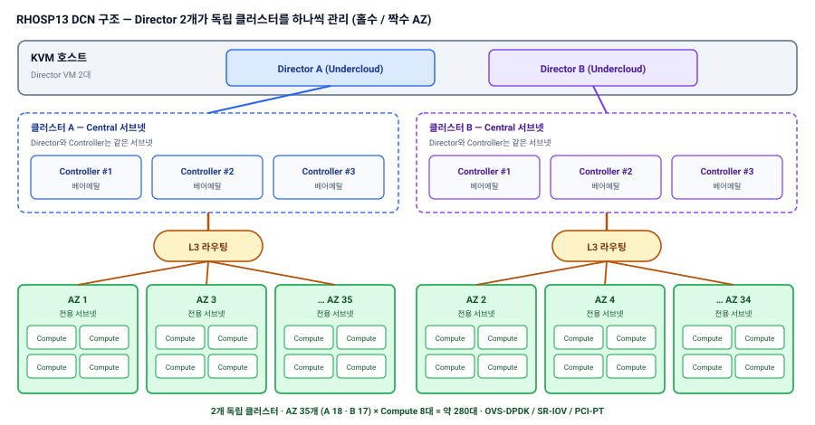

{}


2개|독립 클러스터 (Director A · B)
약 280대|Compute 노드 (DCN)
RHOSP13|Red Hat OpenStack Platform
안정 운영|(무장애) 대규모 통신망


## 프로젝트 개요

| 항목 | 내용 |
|---|---|
| 발주처 | S사(통신사) |
| 기간 | 2020.04 ~ 2023.12 (구축 후 운영 · 기술지원) |
| 사업 | 5G NSA 코어 인프라용 **RHOSP13 기반 가상화 플랫폼** 구축 및 운영 |
| 규모 | 클러스터 2개, Compute 약 280대 (AZ당 8대) |
| 기술 | RHOSP13 · DCN(L3 라우팅) · OVS-DPDK · SR-IOV · PCI Passthrough · Ansible |

## 구축 형태

| 구분 | 구성 |
|---|---|
| 아키텍처 | **DCN(Distributed Compute Node)** — Director 2대(KVM 호스트 VM)가 각각 **독립 클러스터**(Controller 3대 + Compute Zone)를 관리, Compute Zone은 **홀수 / 짝수 AZ로 분리**, Director · Controller는 같은 서브넷, Zone마다 별도 서브넷(L3 라우팅) |
| 성능 | 통신사 VNF 요구에 맞춘 OVS-DPDK, SR-IOV, PCI Passthrough 적용 |
| 운영 | 200대 이상 노드 대상 보안취약점 조치 · 정기점검 **Ansible 자동화**, 결과 중앙 수집 |

## 구성도

## 담당 역할 및 수행 내용

**역할** 가상화 플랫폼 구축 · 운영 · 기술지원

| 영역 | 수행 내용 |
|---|---|
| 네트워크 설계 | Controller ↔ Compute 통신을 **L3 라우팅 구조로 분리** 설계, 데이터센터 간 트래픽 병목 사전 차단 · 확장성 확보 |
| 성능 구성 | OVS-DPDK · SR-IOV · PCI Passthrough 기반 NFV Compute 구성 |
| 운영 | 약 280대 Compute 리소스 모니터링 · 사전 점검 체계 구축, **안정 운영(무장애)** |
| 자동화 | 정기점검 · 보안 조치 Ansible 플레이북 작성 ([관련 글](/blog/rhosp-maintenance-automation/)) |

## 기타

- 이 환경의 Single Stack 구조 한계를 이후 [RHOSP16.2 Multi-Stack 전환](/projects/telco-nfv-dcn-multistack/)으로 해결

{}
