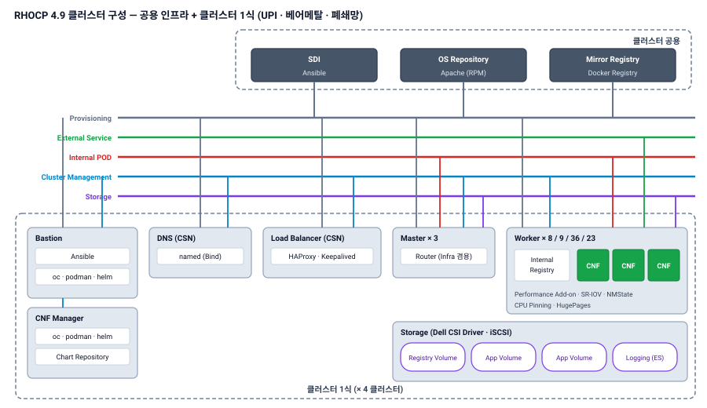

{}


4개|클러스터 (TB 2 · 상용 국사 2)
76대|Worker 노드 (8 · 9 · 36 · 23)
UPI|베어메탈 · 폐쇄망 설치
2개사|5G Core CNF 벤더


## 프로젝트 개요

| 항목 | 내용 |
|---|---|
| 발주처 | S사(통신사) |
| 기간 | 2021.12 ~ 2022.07 |
| 사업 | 5G SA Core CNF를 수용하는 **Red Hat OpenShift(RHOCP) 4.9 컨테이너 플랫폼** 구축 |
| 규모 | 클러스터 4개 — 모두 Master 3대(Infra 겸용), Worker 8 · 9(TB) / 36 · 23(상용 국사) |
| 기술 | RHOCP 4.9 · UPI(베어메탈) · OVN-Kubernetes · SR-IOV · Performance Add-on · NMState · Dell CSI(iSCSI) · Cluster Logging |

## 구축 형태

| 구분 | 구성 |
|---|---|
| 설치 | **UPI · 베어메탈** — Master 3대(Infra 노드 겸용) + Worker |
| 폐쇄망 | Bastion의 Docker Registry 컨테이너로 **RPM · disconnected 이미지 미러** 구성 |
| CSN | Cluster Support Node — **named(DNS) · HAProxy · Keepalived**로 클러스터 API · Ingress 진입 제공 |
| 네트워크 | **OVN-Kubernetes**, SR-IOV Operator, NMState — Provisioning · External Service · POD · Cluster Management · Storage 망 분리 |
| CNF 성능 | **Performance Add-on** — CPU Pinning · HugePages (RHOSP NFV Compute와 동일 개념 적용) |
| 스토리지 | **Dell CSI Driver (iSCSI)** — Registry · App · Logging 볼륨을 PV로 제공 |
| 운영 | Cluster Logging(Elasticsearch), 내부 Image Registry, CNF Manager(Chart Repository) 분리 |

## 구성도

## 담당 역할 및 수행 내용

**역할** RHOCP 4.9 클러스터 구축 · 기능 시험 (팀 4~5명, 4개 클러스터 공동 구축)

| 단계 | 수행 내용 |
|---|---|
| 사전 준비 | Bastion에 RPM · disconnected 이미지 미러 레지스트리 구성, CSN(named · HAProxy · Keepalived) 구성 |
| 클러스터 구축 | UPI 방식 베어메탈 설치 — Master 3 + Worker, TB 2개 · 상용 국사 2개 클러스터 |
| 플랫폼 구성 | OVN-Kubernetes, SR-IOV · NMState · Performance Add-on Operator, Dell CSI(iSCSI) 연동, Cluster Logging |
| CNF 지원 | 2개사 5G Core CNF 배포 환경 제공 — 내부 Image Registry, CNF Manager · Chart Repository |
| 인수시험 | 인증서 자동 갱신, CPU Pinning · HugePages 적용 확인, Image Registry push · pull, CSI 드라이버 연동 · PV 생성 |

## 기타

- 이후 S사 IMS(cMSS) · 가입자 DB(CSDB) · 5G AMF 컨테이너 플랫폼(RHOCP 4.10)으로 구축 · 기술지원 확장, 2024.01 O사 이관 후에도 업무 연속

{}
