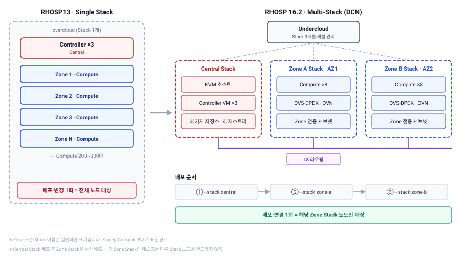
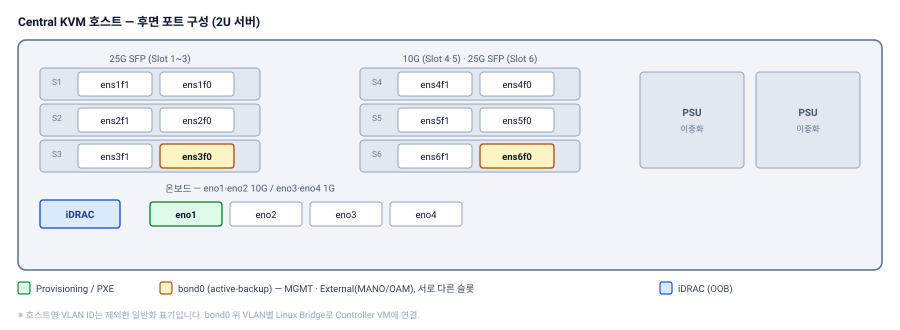

## 개요

| 항목 | 내용 |
|---|---|
| 발주처 | 국내 통신사 |
| 기간 | 2024.07 ~ 2024.09 |
| 역할 | Multi-Stack 설계 · 구축 · 시험 VNF 검증 · 구축 작업절차서 작성 |
| 대상 | 통신사 NFV 플랫폼 TestBed (RHOSP13 → RHOSP16.2 선도입) |
| 구성 | Central Stack (Controller 3, VM) + Compute Zone Stack 2개 (각 8대, 총 16대) |
| 기술 | RHOSP 16.2, RHEL 8.4, TripleO Multi-Stack DCN, ML2/OVN, OVS-DPDK, CPU Pinning, 1G HugePages |

앞서 소개한 [5G NSA 가상화 플랫폼 (RHOSP13)](/projects/s-company-rhosp/)을 운영하면서 겪은 구조적 한계를, 다음 버전에서 구조로 해결한 사례입니다.

## 과제

**1. RHOSP13 EOS**

운영 중인 RHOSP13의 지원 종료가 다가오고 있었습니다. 버전 전환은 피할 수 없었고, 어차피 옮긴다면 기존 구조의 불편함도 함께 해결해야 했습니다.

**2. 하나의 Stack에 묶인 수백 대의 Compute**

RHOSP13의 DCN은 **Single Stack** 구조입니다. Controller와 여러 Zone의 Compute 200~300대가 전부 하나의 Stack에 들어 있습니다.

그래서 한 Zone의 설정을 바꾸려 해도 배포는 항상 전체 노드를 대상으로 돌고, 구성 확인 절차도 전체를 거칩니다. 노드 하나가 응답하지 않으면 관계없는 Zone의 작업까지 영향을 받습니다. **변경 한 번의 영향 범위가 클러스터 전체**였습니다.

**3. 기댈 곳 없는 상황**

벤더 가이드를 받기 전에 TestBed 구축부터 진행해야 했습니다. 공식 문서와 기존 RHOSP16.2 구축 절차서를 기준으로, 설계와 검증을 직접 해나가야 했습니다.

## 수행 내용

### Stack 경계를 Zone 경계에 맞추기

RHOSP16.2부터는 DCN을 **Multi-Stack**으로 구성할 수 있습니다. Undercloud 하나가 여러 개의 Overcloud Stack을 관리하는 방식입니다. 여기서 Stack의 경계를 **가용 영역(AZ) 경계와 똑같이** 그었습니다.

[](multistack-architecture.svg "클릭하면 원본 크기로 열립니다")

| Stack | 구성 | 역할 |
|---|---|---|
| Central | Controller 3대 (VM) | API, DB, 메시지 큐, OVN 제어 |
| Zone A | Compute 8대 (OVS-DPDK) | AZ 1 |
| Zone B | Compute 8대 (OVS-DPDK) | AZ 2 |

Role도 Stack 단위로 나눠 **Central 1개 + Zone별 Compute 2개, 총 3개**를 만들었습니다. Zone Role마다 해당 Zone 전용 네트워크와 서브넷을 붙여, Central과 Zone 사이를 L3 라우팅으로 연결하는 DCN 구조를 그대로 유지했습니다.

배포도 Stack별로 따로 합니다.

```bash
openstack overcloud deploy --templates --stack central   -r roles_data.yaml ...
openstack overcloud deploy --templates --stack zone-a    -r 01-zone-a/roles_data.yaml ...
openstack overcloud deploy --templates --stack zone-b    -r 02-zone-b/roles_data.yaml ...
```

Central을 먼저 배포하고 Zone A, Zone B를 차례로 올렸습니다. Zone Stack 배포는 해당 Zone 노드만 대상으로 돌았고, 다른 Stack의 태스크는 건드리지 않았습니다. **Zone 하나를 배포·변경할 때 다른 Zone에 영향을 주지 않는다는 것**을 이 순차 배포 과정에서 간접적으로 확인할 수 있었습니다. Stack 크기가 작아진 만큼 배포 시간도 짧아졌습니다.

### Central을 VM으로 구성

Controller 3대는 베어메탈 대신 **KVM 호스트 위의 VM**으로 올렸습니다. 같은 호스트에 오프라인 패키지 저장소와 컨테이너 레지스트리도 함께 구성해, 외부 연결 없이 배포할 수 있게 했습니다.

[](kvm-host-network.svg "클릭하면 원본 크기로 열립니다")

| 용도 | 인터페이스 | 본딩 | 브리지 | 대역폭 |
|---|---|---|---|---|
| iDRAC | 전용 포트 | — | — | 1G |
| Provisioning / PXE | 온보드 10G | — | `br-prov` | 10G |
| MGMT | 25G Slot3 + 25G Slot6 | `bond0` (active-backup) | Linux Bridge (VLAN별) | 25G |
| External (MANO / OAM) | 〃 | 〃 | 〃 | 25G |

`bond0`의 두 포트는 **서로 다른 PCIe 슬롯의 NIC**에서 하나씩 가져왔습니다. 카드 하나가 빠져도 Controller VM 전체의 관리망이 끊기지 않게 하기 위해서입니다.

### NFV Compute 튜닝

Zone의 Compute는 패킷 처리 VNF가 올라가는 노드입니다. OVS-DPDK를 쓰고, CPU를 용도별로 완전히 나눴습니다. (2소켓 × 18코어 × HT = 논리 CPU 72개)

| 용도 | 논리 CPU | 파라미터 |
|---|---|---|
| 호스트 · DPDK lcore · VM Emulator | 소켓별 첫 코어 + HT 짝 (4개) | `OvsDpdkCoreList`, `NovaComputeCpuSharedSet` |
| OVS PMD | NUMA별 물리 코어 1개 + HT 짝 (4개) | `OvsPmdCoreList` |
| VM vCPU | 나머지 64개 | `NovaVcpuPinSet`, `isolcpus` |

```yaml
ComputeOvsDpdkZoneAParameters:
  KernelArgs: "default_hugepagesz=1GB hugepagesz=1G hugepages=132 intel_iommu=on iommu=pt
               vfio_iommu_type1.allow_unsafe_interrupts=1 nmi_watchdog=0 transparent_hugepage=never
               intel_idle.max_cstate=0 processor.max_cstate=1 idle=mwait nohpet nosoftlockup
               isolcpus=1-17,19-35,37-53,55-71"
  TunedProfileName: "cpu-partitioning"
  IsolCpusList: "1-17,19-35,37-53,55-71"
  NovaVcpuPinSet: ['2-17','20-35','38-53','56-71']
  NovaComputeCpuSharedSet: "0,18,36,54"
  OvsDpdkCoreList: "0,18,36,54"
  OvsPmdCoreList: "1,19,37,55"
  NovaReservedHostMemory: 16384
  OvsDpdkMemoryChannels: "4"
  OvsDpdkSocketMemory: "2048,2048"
  NovaLibvirtRxQueueSize: 1024
  NovaLibvirtTxQueueSize: 1024
```

PMD 코어를 **NUMA 노드마다 하나씩** 두었습니다. NIC이 붙은 NUMA와 다른 쪽의 PMD가 패킷을 처리하면 소켓 간 메모리 접근이 생겨 지연이 늘어납니다. C-State 제한, `idle=mwait`, `nohpet`, `nosoftlockup`은 모두 CPU가 절전 상태로 들어가거나 인터럽트로 끊기는 것을 막아 **지연의 흔들림(jitter)을 줄이기 위한** 설정입니다.

### Flavor — 물리 토폴로지와 맞추기

```bash
openstack flavor create nfv.dpdk.16c --ram 32768 --disk 40 --vcpus 16
openstack flavor set nfv.dpdk.16c \
  --property hw:cpu_sockets=1 \
  --property hw:cpu_cores=8 \
  --property hw:cpu_threads=2 \
  --property hw:cpu_policy=dedicated \
  --property hw:cpu_thread_policy=prefer \
  --property hw:numa_nodes=1 \
  --property hw:mem_page_size=large \
  --property hw:emulator_threads_policy=share \
  --property hw:watchdog_action=reset
```

| 설정 | 의도 |
|---|---|
| `numa_nodes=1` | VM 하나를 NUMA 노드 하나 안에 가둬 소켓 간 접근 차단 |
| `sockets/cores/threads` | 게스트가 보는 CPU 구조를 실제 물리 구조(HT 짝)와 일치 |
| `cpu_policy=dedicated` | vCPU를 물리 CPU에 고정 |
| `mem_page_size=large` | 1G HugePages 사용 — DPDK vhost-user의 전제 조건 |
| `emulator_threads_policy=share` | QEMU emulator 스레드를 VM 전용 코어가 아닌 호스트 공유 코어(`CpuSharedSet`)로 보냄 |

`emulator_threads_policy=share`가 핵심입니다. 이 값을 주지 않으면 emulator 스레드가 VM에 할당된 전용 코어 위에서 함께 돌며 VNF의 패킷 처리 시간을 빼앗습니다. 호스트 공유 코어로 보내면 **VM의 vCPU는 온전히 VNF 몫**이 됩니다.

### Compute 로컬 디스크 자동 구성

NFV Compute는 공유 스토리지를 쓰지 않고, 인스턴스 디스크를 로컬에 둡니다. OS 디스크와 분리하기 위해 별도 디스크를 `/var/lib/nova/instances`에 붙이는 작업을 **firstboot 템플릿**으로 자동화했습니다.

```bash
if [[ "$(hostname)" =~ "comp" ]]; then
  parted -s /dev/sdb mklabel gpt
  parted -s /dev/sdb mkpart primary 2048 100%
  pvcreate /dev/sdb1
  vgcreate vg-compute /dev/sdb1
  lvcreate -y -l 100%FREE -n hostvolume vg-compute
  mkfs.xfs -L hostvolume /dev/vg-compute/hostvolume
  echo "/dev/vg-compute/hostvolume /var/lib/nova/instances xfs defaults,_netdev 0 0" >> /etc/fstab
  mount -a
  chown -R 42436:42436 /var/lib/nova/instances   # 컨테이너 내부 nova UID
  restorecon -RF /var/lib/nova/instances
fi
```

노드가 처음 부팅될 때 OS가 없는 디스크를 먼저 초기화하고, LVM으로 묶어 마운트까지 끝냅니다. 소유권을 호스트의 nova가 아닌 **컨테이너 내부 nova UID**로 주는 것이 포인트입니다. RHOSP16은 Nova가 컨테이너 안에서 돌기 때문에, 디스크 소유권도 컨테이너 기준으로 맞춰야 합니다.

### 사내 TB에서 먼저 끝까지 돌려보기

고객 TestBed에 들어가기 전에, **사내 TB에서 고객 환경과 똑같은 템플릿으로 전체를 먼저 구축**했습니다. Role 이름, 네트워크 구성, 파라미터까지 동일하게 맞추고 IP만 사내 대역을 썼습니다. DPDK VM 생성까지 사내에서 확인한 뒤 현장으로 가져갔습니다.

현장 작업은 기존 VNF 정리 → KVM 호스트에 저장소·레지스트리·Controller VM 구성 → 베어메탈 Compute를 RHEL 8.4부터 재설치 → Stack 순차 배포 순으로 진행했고, **템플릿에서 IP만 바꿔 별도 이슈 없이 적용**됐습니다.

## 결과

| 항목 | 내용 |
|---|---|
| 구조 | Single Stack → Multi-Stack (Central 1 + Zone 2) |
| 변경 영향 범위 | 클러스터 전체 → 해당 Zone Stack만 |
| 전환 | Compute Zone 2개 (16대) — 이후 Zone 전환에 적용할 기준 모델 |
| NFV 검증 | VM 생성·삭제, CPU Pinning, HugePages 사용, DPDK 소켓 메모리 적용, 외부 통신 |
| 산출물 | 구축 작업절차서 (고객 인수) |

## 배운 것

**Stack의 경계가 운영의 경계입니다.**

Single Stack에서 겪은 불편은 대부분 "관계없는 노드까지 같이 움직인다"는 데서 나왔습니다. Stack을 어디서 자르느냐가 배포 단위, 변경 단위, 장애 영향 단위를 한꺼번에 결정합니다. Zone 경계와 Stack 경계를 일치시키자, 운영자가 머릿속으로 그리는 "이 작업은 이 Zone만 건드린다"는 그림과 실제 배포 범위가 같아졌습니다.

**현장 리스크는 현장에 가기 전에 줄입니다.**

현장에서 이슈가 없었던 건 운이 아니라, 같은 템플릿으로 사내에서 끝까지 한 번 돌려봤기 때문입니다. 핵심은 **IP 외에는 아무것도 바꾸지 않는 것**입니다. Role 이름 하나라도 현장에서 바꾸면, 사내 검증은 다른 환경을 검증한 셈이 됩니다.

**동작하는 설정과 권장 설정은 다를 수 있습니다.**

RHOSP16에서는 전용 CPU를 `NovaComputeCpuDedicatedSet`으로 지정하는 방식이 권장되지만, 이 구축에서는 RHOSP13 방식의 `NovaVcpuPinSet`을 그대로 썼습니다. RHOSP13 기준으로 먼저 구성했는데 사내 TB에서 문제없이 동작해 유지했습니다.

다만 이전 방식은 언젠가 제거됩니다. **지금 동작한다는 것과 다음 버전에서도 동작한다는 것은 별개**라서, 다음 업그레이드 전에 전환해야 할 항목으로 남겨두는 것까지가 설계자의 몫이라고 생각합니다.
