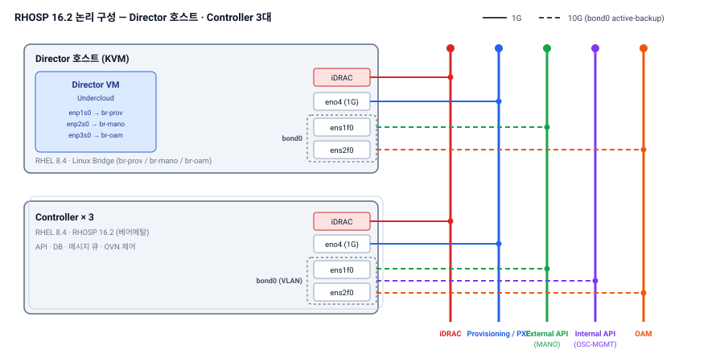

{}


3개사|SMS · MMS VNF 전환 검증
2차|PoC 수행
Controller 3대|전체 다운에도 VNF 무영향
16.2.5 → 16.2.6|무중단 마이너 업데이트 검증


## 프로젝트 개요

| 항목 | 내용 |
|---|---|
| 발주처 | S사(통신사) |
| 기간 | 2024.04 ~ 2024.10 (망 설계 · IP 준비 착수 2024.04 → 장비 입고 · RHOSP 설치 2024.05 → 1차 PoC 2024.06 ~ → Director 호스트 · Controller 3대 선배포 ~2024.08) |
| 사업 | VMware 기반 **메시징 시스템(SMS · MMS, 3개사 VNF)을 RHOSP16으로 전환**하기 위한 PoC 및 상용 플랫폼 구축 (비 DCN 구성) |
| 규모 | Director 1 · Controller 3 · Compute 2 (베어메탈) |
| 기술 | RHOSP 16.2 · OVN · virt-v2v · Cinder Multi-attach · SAN 연동 · NUMA · HugePages |

## 구축 형태

| 구분 | 구성 |
|---|---|
| 배포 | **폐쇄망** — RHEL 8.4 TUS RPM · RHOSP 16.2 컨테이너 이미지 오프라인 구성, Director는 KVM 호스트 위 VM |
| 네트워크 | Provisioning / Internal API / Public API / OAM 분리 (bond + VLAN), VNF당 최대 9개 인터페이스 대응 |
| Compute | BIOS(C-State · Turbo · 전력 프로파일) + OS(CPU Isolation · 1G HugePages · NUMA) 성능 튜닝 |
| 스토리지 | SAN 스토리지 Cinder 연동, **Multi-attach** 검증 |
| 이미지 | PoC에서 만든 OpenStack 이미지를 **상용에 그대로 사용** |

## 구성도

| 망 | 용도 |
|---|---|
| iDRAC | 물리 호스트 원격 제어 · 감시, Director의 전원 제어 |
| Provisioning / PXE | Director가 OS 설치 및 OpenStack 자동 배포에 사용 |
| External API (MANO) | Public API (Controller만 연결) |
| Internal API (OSC-MGMT) | Controller ↔ Compute 내부 API · 메시지 통신 |
| OAM | VM 관리 접속 경로 |

## 담당 역할 및 수행 내용

**역할** PoC 인프라 설계 · RHOSP16 구축 · 마이그레이션 및 장애 복구 검증 — **RHOSP 파트 파트장 (5명)**

| 단계 | 수행 내용 |
|---|---|
| 인프라 설계 · 구축 | Director 호스트, Controller · Compute 하드웨어 · 네트워크 설계, RHOSP 16.2 오버클라우드 배포 |
| 마이그레이션 검증 | 필수 이관 VM을 인스턴스로 전환해 구성 · 기능 동작 · 자체 성능측정 수행, virt-v2v 변환 시연(300GB 약 5시간) → 상용은 **골든 이미지 + rsync 방식** 권고 (다운타임을 IP 전환 구간으로 한정) |
| 이슈 대응 | 공유 SAN 디스크 OVF 누락 → Cinder Multi-attach 검증 추가, UEFI 이미지 `hw_firmware_type` 대응, 원본 3배 용량 산정 · 디스크 재구성 |
| 장애 복구 시험 | 서비스 컨테이너 · Controller 순차 Power-off · Compute 재기동 · 스냅샷 복원 · 롤링 업데이트, 2차는 **최대 부하 상태**에서 수행 |
| 상용 구축 | PoC 종료 직후 구축 착수 — **Director 호스트 · Controller(OSC) 3대 선배포** (~2024.08), Compute는 수량 미확정으로 개략 설계까지 수행 (증설은 퇴사 이후) |
| 산출물 | 구축 절차서 · 연동 결과서, 상용 전환 방안 제안 |

| 방식 | 절차 | 다운타임 | 판단 |
|---|---|---|---|
| virt-v2v | OVF export → qcow2 변환 → Glance → 생성 | 길다 | PoC 시연 |
| 신규 배포 + rsync | 골든 이미지 배포 → 데이터 동기화 → IP 전환 | 짧다 | **상용 권고** |

## 기타

- Controller 3대 전체 다운 시에도 Compute의 VNF 무영향 — 컨트롤 · 데이터 플레인 분리 실증

{}
